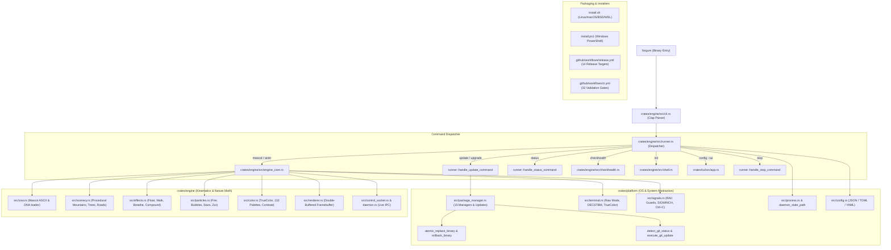
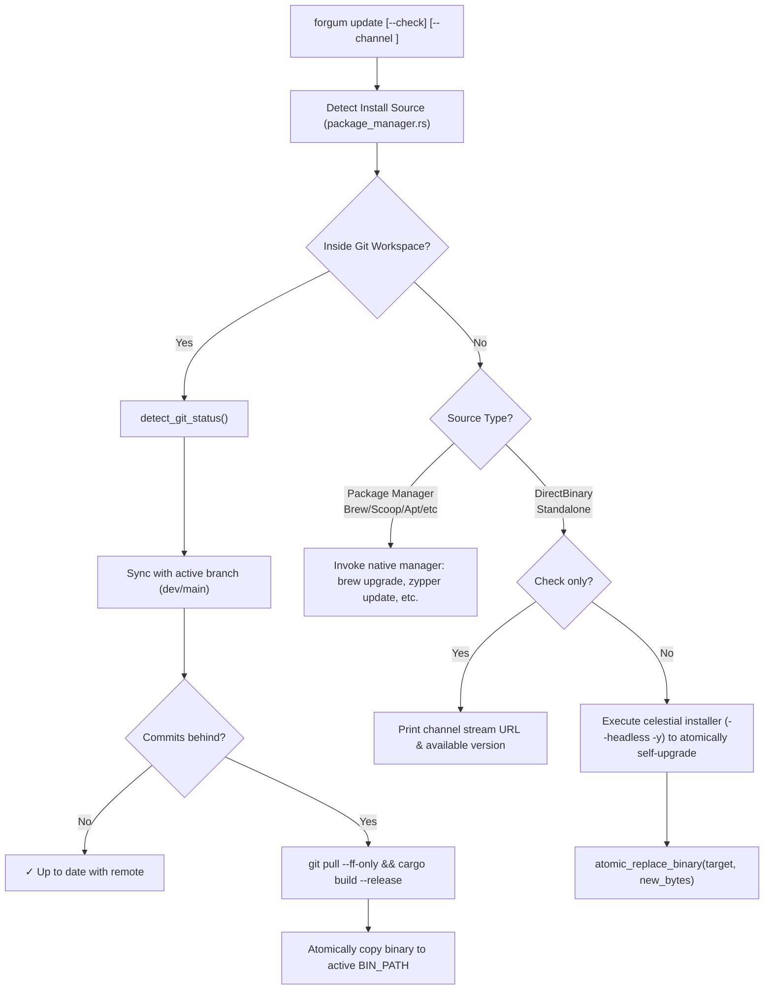
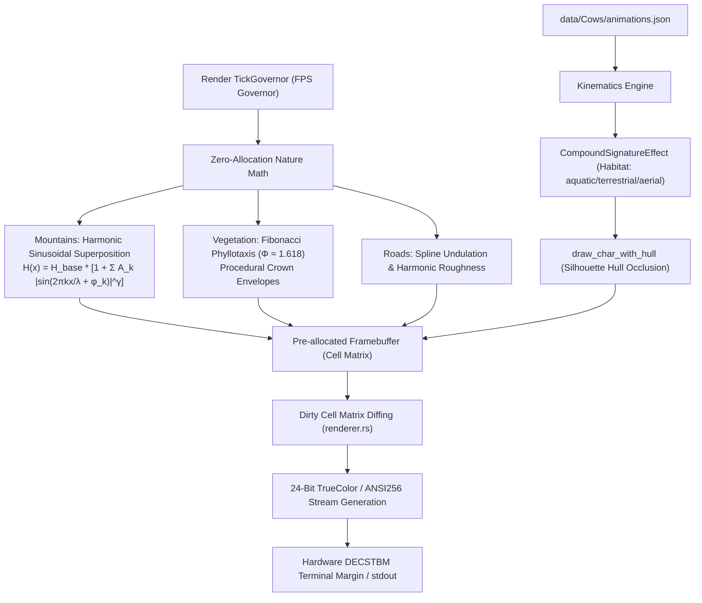

# Forgum Master Architecture & Codebase Map (`ARCHITECTURE_MAP.md`)

> **MANDATORY NOTICE FOR ALL AI AGENTS**:
> Before executing broad searches with `ripgrep`, `grep`, or code search tools, agents **MUST** inspect this document.
> It contains the authoritative map of all file locations, key functions, data structures, execution pipelines, and graphical Mermaid mind maps for the entire Forgum repository.

---

## 1. System Topology Mind Map

---

## 2. Execution Pipelines & Workflow Maps

### A. Auto-Update Pipeline (`forgum update`)

### B. Rendering & Nature Mathematics Pipeline (<100MB RAM Mandate)

---

## 3. Directory & File Reference Index

### `crates/platform` (OS, Process, Terminal & Package Management)

| Path | Primary Functions & Structs | Purpose / Interaction |
| :--- | :--- | :--- |
| [`crates/platform/src/package_manager.rs`](file:///Z:/Projects/Forgum/crates/platform/src/package_manager.rs) | `PackageManager`, `execute_package_manager_action`, `detect_installation_source`, `detect_shadow_installations`, `atomic_replace_binary`, `rollback_binary`, `detect_git_status`, `check_git_updates`, `execute_git_update`, `read_receipt`, `record_receipt` | Manages all 15 package managers, standalone binary atomic upgrades, Git tracking, receipt tracking (`receipt.json`). |
| [`crates/platform/src/terminal.rs`](file:///Z:/Projects/Forgum/crates/platform/src/terminal.rs) | `TerminalGuard`, `enable_raw_mode`, `terminal_size`, `detect_truecolor_support`, `setup_decstbm_margins`, `reset_margins` | Terminal hardware abstraction, raw mode, alt-screen, TrueColor detection, DECSTBM hardware scroll margins. |
| [`crates/platform/src/signals.rs`](file:///Z:/Projects/Forgum/crates/platform/src/signals.rs) | `SignalGuard`, `register_signal_handlers`, `poll_resize_event` | Intercepts `SIGINT`, `SIGTERM`, `SIGWINCH` for clean cursor restoration and viewport resize events. |
| [`crates/platform/src/process.rs`](file:///Z:/Projects/Forgum/crates/platform/src/process.rs) | `kill_process`, `is_process_running`, `daemon_state_path`, `detect_session_id` | Cross-platform PID inspection, process killing, daemon lock files and session multiplexer IDs. |
| [`crates/platform/src/config.rs`](file:///Z:/Projects/Forgum/crates/platform/src/config.rs) | `Config`, `load_config`, `save_config`, `config_dir`, `resolve_format` | Multi-format settings parser (JSON, TOML, YAML) with XDG/Windows AppData resolution. |
| [`crates/platform/src/biome.rs`](file:///Z:/Projects/Forgum/crates/platform/src/biome.rs) | `detect_system_biome`, `SystemBiome`, `TimeOfDay` | Environmental telemetry detecting host time-of-day, battery state, and visual themes. |

---

### `crates/engine` (CLI, Animations, Scenery & Rendering)

| Path | Primary Functions & Structs | Purpose / Interaction |
| :--- | :--- | :--- |
| [`crates/engine/src/main.rs`](file:///Z:/Projects/Forgum/crates/engine/src/main.rs) | `main()` | Minimal entrypoint calling `runner::run()`. |
| [`crates/engine/src/cli.rs`](file:///Z:/Projects/Forgum/crates/engine/src/cli.rs) | `Cli`, `Commands` (`Update`, `Channel`, `Init`, `Config`, `Status`, `CheckHealth`, `Stop`, `Mascots`) | Clap CLI specification, argument definitions, aliases, and help manuals. |
| [`crates/engine/src/runner.rs`](file:///Z:/Projects/Forgum/crates/engine/src/runner.rs) | `run()`, `handle_update_command`, `handle_status_command`, `handle_channel_command`, `handle_stop_command` | Primary dispatch controller routing subcommands to execution handlers. |
| [`crates/engine/src/engine_core.rs`](file:///Z:/Projects/Forgum/crates/engine/src/engine_core.rs) | `Engine`, `run_loop()`, `TickGovernor` | Core animation event loop, fixed FPS governance, DEC 2026 synchronized updates. |
| [`crates/engine/src/renderer.rs`](file:///Z:/Projects/Forgum/crates/engine/src/renderer.rs) | `Renderer`, `Cell`, `Buffer`, `render_diff()` | Double-buffered terminal drawing, cell color caching, dirty-line escape code generation. |
| [`crates/engine/src/scenery.rs`](file:///Z:/Projects/Forgum/crates/engine/src/scenery.rs) | `SceneryRenderer`, `render_mountains()`, `render_trees()`, `render_road()` | Procedural harmonic mountains, Fibonacci phyllotaxis tree generation, road texturing (<100MB RAM). |
| [`crates/engine/src/effects.rs`](file:///Z:/Projects/Forgum/crates/engine/src/effects.rs) | `Effect` trait, `FloatEffect`, `WalkEffect`, `BreatheEffect`, `CompoundSignatureEffect` | Kinematics calculation, bobbing, walking translation, habitat compatibility checks. |
| [`crates/engine/src/particles.rs`](file:///Z:/Projects/Forgum/crates/engine/src/particles.rs) | `ParticlePool`, `ParticleType` (`Fire`, `Bubbles`, `Stars`, `Zzz`) | Zero-allocation particle simulation for animal DNA effects. |
| [`crates/engine/src/cow.rs`](file:///Z:/Projects/Forgum/crates/engine/src/cow.rs) | `Cow`, `load_cow()`, `parse_cowfile()`, `draw_char_with_hull` | Mascot loader, eye/tongue replacements, speech bubble anchoring, silhouette hull occlusion. |
| [`crates/engine/src/color.rs`](file:///Z:/Projects/Forgum/crates/engine/src/color.rs) | `ColorPalette`, `get_natural_palette()`, `boost_contrast_for_acrylic` | Natural biological morph palettes for 132 mascots, terminal theme abidance, liquid glass contrast boosting. |
| [`crates/engine/src/shell.rs`](file:///Z:/Projects/Forgum/crates/engine/src/shell.rs) | `generate_hook()`, `install_hook()`, `remove_hook()` | Universal shell integration across 15 shells (Bash, Zsh, Fish, PowerShell, Pwsh, Nushell, etc.). |
| [`crates/engine/src/daemon.rs`](file:///Z:/Projects/Forgum/crates/engine/src/daemon.rs) | `DaemonState`, `spawn_daemon()`, `clean_dead_daemons()` | Background animation daemon management and lifecycle tracking. |
| [`crates/engine/src/control_socket.rs`](file:///Z:/Projects/Forgum/crates/engine/src/control_socket.rs) | `listen_control_socket()`, `send_ipc_thought()` | IPC sockets (Unix domain sockets / Windows named pipes) for live thought hotswapping. |
| [`crates/engine/src/checkhealth.rs`](file:///Z:/Projects/Forgum/crates/engine/src/checkhealth.rs) | `run_checkhealth()` | 19-point comprehensive diagnostic system reporting platform, terminal, config, and package manager health. |

---

### `crates/tui` (Interactive Terminal UI)

| Path | Primary Functions & Structs | Purpose / Interaction |
| :--- | :--- | :--- |
| [`crates/tui/src/app.rs`](file:///Z:/Projects/Forgum/crates/tui/src/app.rs) | `App`, `run_app()`, `draw()`, `handle_input()` | Ratatui TUI dashboard: mascot browser, real-time preview, settings editor, horizontal scrolling, contrast presets. |
| [`crates/tui/src/lib.rs`](file:///Z:/Projects/Forgum/crates/tui/src/lib.rs) | `run_tui()` | Entry interface called by `forgum config --tui`. |

---

### `data/Cows` & Assets

| Path | Purpose |
| :--- | :--- |
| [`data/Cows/animations.json`](file:///Z:/Projects/Forgum/data/Cows/animations.json) | Authoritative DNA catalog for all 132 mascots: biological habitat (`aquatic`, `terrestrial`, `aerial`), particle emitters, speed, glow colors, and permitted effects. |
| `data/Cows/*.cow` | Mascot ASCII templates with `$eyes`, `$tongue`, and `$thoughts` replacement variables. |

---

### Packaging, Installers & CI/CD

| Path | Key Mechanics & Rules |
| :--- | :--- |
| [`install.sh`](file:///Z:/Projects/Forgum/install.sh) | Celestial Unix installer: detects Linux/macOS/BSD/WSL, installs dependencies via Zypper/APT/DNF/Pacman/APK/Brew/Pkg, verifies MSRV, downloads or builds binary, manages PATH, records receipt. |
| [`install.ps1`](file:///Z:/Projects/Forgum/install.ps1) | Celestial Windows installer: PowerShell-based download, unzipping, `%LOCALAPPDATA%\Programs\forgum` placement, environment PATH registration. |
| [`.github/workflows/ci.yml`](file:///Z:/Projects/Forgum/.github/workflows/ci.yml) | 32 CI validation jobs: MSRV 1.98.0, 15 shell hook validations, Pester tests, Rust toolchains on Ubuntu/Windows/macOS, Code Coverage, Contributor Gate. |
| [`.github/workflows/release.yml`](file:///Z:/Projects/Forgum/.github/workflows/release.yml) | Multi-channel release builder: 14 targets (Linux x86_64, aarch64, armv7, riscv64; Windows x64, arm64, i686; macOS x64, arm64; FreeBSD; DEB; RPM; MSI; Choco; Nix; Pacman). Writes archives to `$GITHUB_WORKSPACE` for GitHub Release publishing. |

---

## 4. Key Rules for Agents When Modifying Code

1. **Check `ARCHITECTURE_MAP.md` First**: Always consult this map before searching the codebase.
2. **Never Autonomous Tagging / Version Bumping**: Versions are bumped ONLY on explicit user command.
3. **Strict Single Keyword**: User-facing commands and binaries must strictly route through `forgum`.
4. **Preserve Habitat Taxonomy**: Aquatic animals do NOT walk; they swim or float below water lines.
5. **Memory Constraint (<100MB RAM)**: Never allocate inside frame render loops. Operate on stack and pre-allocated buffers.
6. **Double-Ended Reversibility**: All shell hooks, installs, and uninstalls must support clean removal without leaving orphaned artifacts.
