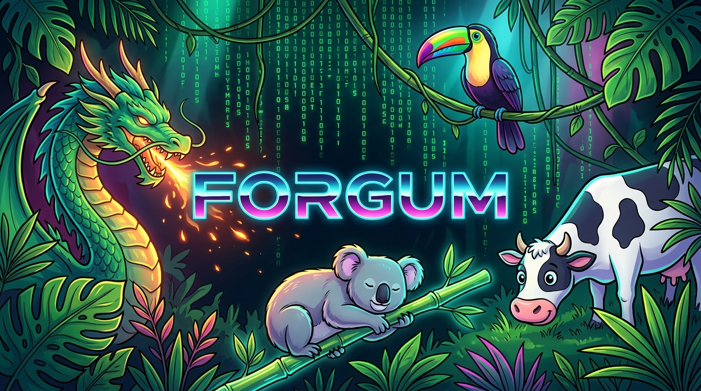

<p align="center">
  
</p>

```text
+--------------------------------------------------------------------------------------------------+
|                              *  ~  *  FORGUM JUNGLE ENGINE  *  ~  *                              |
+==================================================================================================+
|        .~~.                                                                       .~~.           |
|       (____)                                                                     (____)          |
|     .-'    `-.                                                                 .-'    `-.        |
|   .'  / \  //\`.       ███████╗ ██████╗ ██████╗  ██████╗ ██╗   ██╗███╗   ███╗  .'  ^__^     `.   |
|  /|\___/| /   \`\      ██╔════╝██╔═══██╗██╔══██╗██╔════╝ ██║   ██║████╗ ████║ /   /(oo)\____  \  |
| / /O   O \/ // \ \     █████╗  ██║   ██║██████╔╝██║  ███╗██║   ██║██╔████╔██║ |  /  (__)    )\ | |
| |( @_^_@ ) //   | |    ██╔══╝  ██║   ██║██╔══██╗██║   ██║██║   ██║██║╚██╔╝██║ |     ||---w | | | |
|  \ \__^_/ //    | /    ██║     ╚██████╔╝██║  ██║╚██████╔╝╚██████╔╝██║ ╚═╝ ██║ \     ||    || / / |
|   `-(_//)//____.-'     ╚═╝      ╚═════╝ ╚═╝  ╚═╝ ╚═════╝  ╚═════╝ ╚═╝     ╚═╝  `-.________..-'   |
|       //  ||              * * *  A N I M A T E D   P A S T U R E  * * *             ||    ||     |
|      //   ||              ___                                     ,___.             ||    ||     |
|     //    ||            {~o.o~} ( ( (   K I N E M A T I C   ) ) ) {o,o}             ||    ||     |
|    //     ||             ( Y )  ) ) )      J U N G L E      ( ( ( /)__)             ||    ||     |
|   //      ||            ()~*~() ( ( (      M O T I O N      ) ) )  ""               ||    ||     |
+==================================================================================================+
|     [Dragon: Ember]           [Koala: Zen]           [Toucan: Sky]          [Cow: Pasture]       |
+--------------------------------------------------------------------------------------------------+
```

> **Forgum** is a high-performance Rust terminal animation engine that renders living ANSI creatures in your terminal —
> featuring physical 2D kinematics (stride-coupled ground traversal, flight swoops, Lissajous drift), 15 preloaded themes,
> zero-alloc dirty-damage rasterization, fail-safe signal/input handling, shell hooks, daemons, and capability probes.
> Cross-platform on Windows, macOS, and Linux.

**Repo:** `HKDevLoops/Forgum` · **Version:** `alpha-0.0.1` · **License:** MIT

<p align="center">
  <a href="docs/TELEMETRY.md"></a>
  <a href="docs/TELEMETRY.md"></a>
  <a href="docs/TELEMETRY.md"></a>
  <a href="docs/TELEMETRY.md"></a>
</p>

---

## 🚀 Celestial Quickstart & Installation

Forgum features a celestial, **Omarchy and Celestial Shell-inspired Terminal UI Wizard** with rich TrueColor ASCII art, automatic shell detection, and transparent privacy permission controls.

```text
  ✦ CELESTIAL INSTALLER ✦   [1] Welcome  ── [2] Privacy  ── [3] Shells  ── [4] Install  ── [5] Blastoff
  ╭───────────────────────────────╮
  │   ✦  F O R G U M   O S  ✦     │   Detects: PowerShell 7, Pwsh, Bash, Zsh, Fish, Nushell
  ╰───────────────────────────────╯   Zero Surveillance · Transparent Consent · 100% Offline
```

### 📦 1-Command Installation

#### Windows (PowerShell 5.1 / PowerShell 7+):
```powershell
# Interactive Celestial TUI Wizard:
irm https://raw.githubusercontent.com/HKDevLoops/Forgum/main/install.ps1 | iex

# Or run locally from clone:
./install.ps1
```

#### macOS & Linux (Bash / Zsh / Fish):
```bash
# Interactive Celestial TUI Wizard:
curl -fsSL https://raw.githubusercontent.com/HKDevLoops/Forgum/main/install.sh | bash

# Or run locally from clone:
./install.sh
```

#### 🛡 Headless & Offline Install:
Prefer zero interactive UI and zero telemetry? Install headlessly with telemetry declined:
```powershell
./install.ps1 -Headless -Telemetry decline
```
```bash
./install.sh --headless --telemetry decline
```

> [!NOTE]
> **Motivation & Curiosity Telemetry Notice**:
> Forgum collects ONLY three aggregate community counters (`users_tried`, `users_installed`, `active_users`) purely for developer motivation. Zero surveillance, zero IP logging, zero personal data. Read our full commitment in [`docs/TELEMETRY.md`](docs/TELEMETRY.md).

### 🌐 Multi-Channel Package Managers

Forgum is packaged and distributed across every major operating system, architecture, and package manager:

| OS | Package Manager | Installation Command | Update Command |
| :--- | :--- | :--- | :--- |
| **Windows** | **Scoop** | `scoop bucket add hkdevloops https://github.com/HKDevLoops/scoop-bucket; scoop install forgum` | `scoop update forgum` |
| **Windows** | **WinGet** | `winget install HKDevLoops.Forgum` | `winget upgrade HKDevLoops.Forgum` |
| **Windows** | **Chocolatey** | `choco install forgum -y` | `choco upgrade forgum -y` |
| **macOS & Linux** | **Homebrew** | `brew install hkdevloops/tap/forgum` | `brew upgrade forgum` |
| **Arch Linux** | **AUR (yay / paru)** | `yay -S forgum` or `paru -S forgum` | `yay -Syu` |
| **Debian / Ubuntu** | **APT / dpkg** | `sudo dpkg -i forgum-*.deb` | `sudo apt install --only-upgrade forgum` |
| **Fedora / RHEL** | **DNF / RPM** | `sudo rpm -ivh forgum-*.rpm` | `sudo dnf upgrade forgum` |
| **openSUSE** | **Zypper** | `sudo zypper install forgum-*.rpm` | `sudo zypper update forgum` |
| **Nix / NixOS** | **Nix Profile** | `nix profile install github:HKDevLoops/Forgum` | `nix profile upgrade forgum` |
| **Alpine Linux** | **APK** | `apk add forgum` | `apk upgrade forgum` |
| **Void Linux** | **XBPS** | `xbps-install -S forgum` | `xbps-install -Su forgum` |
| **FreeBSD** | **pkg** | `pkg install forgum` | `pkg upgrade forgum` |
| **macOS** | **MacPorts** | `sudo port install forgum` | `sudo port upgrade forgum` |
| **Universal** | **Cargo (Rust)** | `cargo install forgum-cli` | `cargo install --force forgum-cli` |

---

### 🐚 Universal 15-Shell Integration Matrix

Forgum natively supports all 15 major terminal shells. Add the one-line hook or run completions:

| Shell | Shell Prompt Hook (`forgum init <shell>`) | Completions Generator (`forgum completions <shell>`) |
| :--- | :--- | :--- |
| **PowerShell 7+ (`pwsh`)** | `forgum init pwsh \| Out-String \| Invoke-Expression` | `forgum completions pwsh` |
| **Windows PowerShell 5.1** | `forgum init powershell \| Out-String \| Invoke-Expression` | `forgum completions powershell` |
| **Bash** | `eval "$(forgum init bash)"` | `forgum completions bash` |
| **Zsh** | `eval "$(forgum init zsh)"` | `forgum completions zsh` |
| **Fish** | `forgum init fish \| source` | `forgum completions fish` |
| **Nushell** | `forgum init nushell \| save -f ~/.config/nushell/forgum.nu; use ~/.config/nushell/forgum.nu *` | `forgum completions nu` |
| **Elvish** | `eval (forgum init elvish \| slurp)` | `forgum completions elvish` |
| **Cmd (`cmd.exe`)** | `forgum init cmd > %TEMP%\forgum_cmd.cmd && call %TEMP%\forgum_cmd.cmd` | N/A (doskey alias) |
| **Carapace** | Sourced via Carapace engine | `forgum completions carapace` |
| **Xonsh** | `exec($(forgum init xonsh))` | `forgum completions xonsh` |
| **Tcsh (`csh`)** | `eval \`forgum init tcsh\`` | `forgum completions tcsh` |
| **Ksh (`ksh93/mksh`)** | `eval "$(forgum init ksh)"` | `forgum completions ksh` |
| **Ion** | `eval (forgum init ion)` | `forgum completions ion` |
| **Oil (`osh/ysh`)** | `eval "$(forgum init oil)"` | `forgum completions oil` |
| **Yash** | `eval "$(forgum init yash)"` | `forgum completions yash` |

---

### 🩺 Multi-Channel Maintenance & Doctor

Keep Forgum healthy, updated, and diagnosed with built-in commands:

```bash
# Check for updates across your detected package manager:
forgum update --check

# Upgrade Forgum using your native package manager:
forgum update

# Run comprehensive system, shell, and package manager diagnostic health check:
forgum checkhealth

# View, query, and diagnose structured engine logs:
forgum logs --diagnose
```

---

## 🌌 Clean Uninstallation (Two Distinct Methods)

Forgum guarantees total respect for your system with **two distinct, user-directed uninstallation methods**:

```text
                          ┌───────────────────────────┐
                          │   forgum uninstall / TUI  │
                          └─────────────┬─────────────┘
                                        │
                    ┌───────────────────┴───────────────────┐
                    ▼                                       ▼
        ┌───────────────────────┐               ┌───────────────────────┐
        │ [1] Soft Uninstall    │               │ [2] Purge Uninstall   │
        │  (Keep Configuration) │               │   (Clean Slate)       │
        └───────────┬───────────┘               └───────────┬───────────┘
                    │                                       │
        • Remove binary from PATH               • Remove binary from PATH
        • Strip shell prompt hooks              • Strip shell prompt hooks
        • Strip shell completions               • Strip shell completions
        • Delete completions folder             • Delete completions folder
        • PRESERVE ~/.config/forgum/            • DELETE ~/.config/forgum/
        • PRESERVE custom .cow files            • DELETE all logs & cache
        • PRESERVE user preferences             • DELETE state & daemon sockets
```

### Method 1: Soft Uninstall (Keep Configuration)
Removes the binary from disk and User PATH, strips prompt hooks and completions from all shell profiles, but **PRESERVES** `~/.config/forgum/` (configuration, custom mascots, themes) so your customizations remain intact if you reinstall later:
```bash
forgum uninstall --method soft
# or using standalone script:
./uninstall.sh --method soft
```
```powershell
./uninstall.ps1 -Method Soft
```

### Method 2: Purge Uninstall (Clean Slate)
Completely wipes everything. Leaves zero traces on your system:
```bash
forgum uninstall --method purge --yes
# or using standalone script:
./uninstall.sh --method purge --yes
```
```powershell
./uninstall.ps1 -Method Purge -Yes
```

### 💫 Interactive Celestial De-Orbit Wizard:
Launch the interactive terminal UI with supernova ASCII art to review removals before executing:
```bash
forgum uninstall --tui
```
```powershell
./uninstall.ps1 -Tui
```

---

## 📖 The Story Behind Forgum: From Static Mascots to Kinetic Art

In 1999, the terminal world welcomed `cowsay`. It was simple, charming, and brought warmth and humor to text consoles. For more than two decades, it served as a beloved staple in dotfiles, motd banners, and terminal scripts across Unix and Linux systems.

As modern terminal emulators evolved to support 24-bit TrueColor, Unicode, and rapid VT rendering, an intriguing engineering question presented itself: *What if our terminal mascots could gently inhabit the terminal, moving across procedural landscapes while remaining lightweight and respectful of system resources?*

**Forgum** was developed to explore that vision. 🌿

Rather than printing static text directly into the shell scrollback buffer, Forgum introduces a modular, **lock-free, 3-threaded engine** (`SIM`, `RENDER`, `CONTROL`). Mascots move according to **classical kinematics and 2D orbital trajectories**, allowing them to walk, glide, and rest across mathematically generated natural scenery. Through **differential dirty-cell damage tracking**, frame rasterization updates only the exact character cells that change, avoiding full-screen refreshes.

Forgum runs unobtrusively *above* your active shell prompt. Whether a dragon glides across the horizon, a koala rests with rhythmic chest oscillation, or a cow walks across an undulating trail, Forgum delivers consistent **60 FPS** presentation while maintaining a lean memory and CPU footprint.

---

## 🌿 Modernizing Terminal Mascots with Thoughtful Engineering

| Classic Terminal Mascots (1999)                                               | Modern Architecture in Forgum (2026)                                                                                              | Practical Benefits                                                    |
| :---------------------------------------------------------------------------- | :-------------------------------------------------------------------------------------------------------------------------------- | :-------------------------------------------------------------------- |
| 📜 **Static Scrollback Output:** Mascots print once and remain in scrollback.  | 🏃 **2D Continuous Kinematics:** Mascots navigate terminal margins and procedural horizons in real-time.                         | Living, animated canvas without cluttering shell history.             |
| 🔄 **In-Place Leg Cycling:** Leg characters cycle regardless of movement.      | 📐 **Stride-Velocity Coupling:** Leg cadence is mathematically synchronized to ground velocity ($\omega = v/\lambda$).            | Natural gait locomotion: if the mascot halts, hoof animation pauses. |
| 🖥️ **Full-Screen Clears:** Clears entire screen (`\x1b[2J]`), risking flicker. | ⚡ **Dirty-Cell Damage Tracking:** Diff-compares buffers, emitting minimal ANSI coordinate jumps (`\x1b[y;xH`) only where changed. | Fluid 60 FPS animation with sub-1% CPU consumption.                  |
| 🔒 **Global File Locks:** Risk of contention across multiple shell instances. | 🪟 **Pane-Level Session Isolation:** Independent session routing across `tmux`, `zellij`, `wezterm`, `kitty`, and Windows Terminal. | Concurrent execution across terminal panes without contention.        |
| 🛑 **Raw Mode Signal Delays:** Signal propagation can lag in raw terminal mode. | ⏱️ **Sub-Millisecond Signal Handling:** Non-blocking event loops poll and respond to `Ctrl+C`, `'q'`, and `Esc` within milliseconds.  | Clean, prompt terminal restoration upon exit or interruption.         |
| ⚙️ **Manual Configuration Files:** Requires manual editing of syntax dotfiles. | 🎨 **Interactive TUI & 15 Curated Themes:** Built-in settings explorer with presets (`matrix`, `cyberpunk`, `forest`, `zen`, etc.). | Zero-configuration by default, with complete interactive control.     |

---

## 🧮 The Engine Under the Hood: Discrete Kinetic Calculus & Nature Mathematics

Forgum's motion and procedural scenery are driven by continuous classical kinematics and deterministic computational geometry running at up to 120 FPS:

### 1. Continuous Kinematic Integration
Every frame, the physics pipeline evaluates floating-point position $\vec{P}(t)$, velocity $\vec{V}(t)$, and acceleration $\vec{A}(t)$ using deterministic time-delta $\Delta t$:

$$\vec{P}(t + \Delta t) = \vec{P}(t) + \vec{V}(t)\Delta t + \frac{1}{2}\vec{A}(t)\Delta t^2$$

$$\vec{V}(t + \Delta t) = \vec{V}(t) + \vec{A}(t)\Delta t$$

Sub-character coordinates are projected onto discrete monospace grid cell quanta via midpoint quantization:

$$x_{\text{col}} = \lfloor P_x \rceil, \quad y_{\text{row}} = \lfloor P_y \rceil$$

### 2. Stride-Velocity Coupling
In `WalkEffect`, hoof stride frequency $\omega_{\text{stride}}$ is geometrically locked to instantaneous horizontal ground velocity $\vec{V}_x$ and stride wavelength $\lambda_{\text{step}}$:

$$\phi_{\text{stride}}(t) = \left( \frac{|P_x(t)|}{\lambda_{\text{step}}} \right) \pmod{1.0}$$

$$\text{LegState}(t) = \begin{cases} (\text{'╱'}, \text{'╲'}), & \text{if } \text{SmoothStep}(\phi_{\text{stride}}) > 0.5 \\ (\text{'╲'}, \text{'╱'}), & \text{otherwise} \end{cases}$$

When the mascot advances, its legs step in exact geometric lockstep with the ground beneath it. If ground velocity halts, leg oscillation ceases immediately.

### 3. Harmonic 2D Lissajous Orbital Drift (`float`)
Aquatic and celestial mascots (`dolphin`, `nyan`, `happy-whale`) follow orthogonal dual-frequency phase-shifted harmonic oscillations producing 2D Lissajous trajectories:

$$X(t) = X_{\text{anchor}} + A_x \cdot \sin(\omega_x t + \delta_x), \quad Y(t) = Y_{\text{anchor}} + A_y \cdot \cos(\omega_y t + \delta_y)$$

$$\text{with } \frac{\omega_x}{\omega_y} \in \mathbb{Q}, \quad \delta = \delta_x - \delta_y = \frac{\pi}{4}$$

This models organic, undulating buoyancy drift across terminal boundaries without sharp directional jerks.

### 4. Sinusoidal Ballistic Flight Trajectories (`fly`)
Airborne creatures (`dragon`, `golden-eagle`, `pterodactyl`) follow continuous flight paths modulated by dual-harmonic altitude swoops:

$$X(t) = (X_0 + V_x \cdot t) \pmod{W_{\text{term}} + W_{\text{critter}}} - W_{\text{critter}}$$

$$Y(t) = Y_{\text{cruise}} + A_1 \cdot \sin(2\pi f_1 t) + A_2 \cdot \cos(4\pi f_2 t + \phi)$$

Wing flap cadence dynamically scales proportionally to vertical climb gradient $|\frac{dY}{dt}|$, harmonizing with avian bio-mechanics.

### 5. Nature Mathematics: Mountain Elevation & Deterministic Peak Count
Procedural alpine peaks, mesas, and volcanic calderas are generated deterministically per column $x$ using multi-harmonic sinusoidal superposition:

$$H(x) = H_{\text{base}} \cdot \left[ 1 + \sum_{k=1}^{K} A_k \cdot \left| \sin\left( \frac{2\pi k}{\lambda} x_{\text{world}} + \phi_k \right) \right|^\gamma \right]$$

The peak count $N_{\text{peaks}}$ scales mathematically with viewport width $W$ and the Golden Ratio ($\Phi \approx 1.6180339887$):

$$N_{\text{peaks}} = \mathrm{clamp}\left(\left\lfloor \frac{W}{\lambda \cdot (\Phi / 2)} \right\rceil, 1, 12\right)$$

- **Alpine Peaks & Glaciers**: Power-pinched exponent $\gamma = 1.85$ sculpts sharp glacial horn peaks separated by broad cirque valleys.
- **Plateaus & Mesas**: Hyperbolic tangent saturation $H(x) \propto \tanh(3 \sin(\omega x))$ produces flat-topped mesas with sheer vertical escarpments.
- **Volcanic Cones**: Lorentzian distribution $\frac{A}{1 + (x/\sigma)^2}$ coupled with a central inverted caldera basin models volcanic topography.

### 6. Biological Flora Spacing & Stature-Scaled Canopy
Procedural trees and midground vegetation mimic natural botanical stands using Fibonacci / Golden Ratio phyllotaxis spacing ($\Phi^{-1} \approx 0.61803398875$):

$$d(k) = \max\left(0.7 \cdot d_{\min}, \; d_{\min} + \{k \cdot \Phi^{-1}\} \cdot d_{\text{var}} + \frac{d_{\text{var}}}{4} \cos\left(2\pi \{k \cdot \Phi^{-2}\}\right)\right)$$

- **Root Exclusion & Grove Clustering**: The cosine modulation alternates between clustered groves (stands) and open clearings while enforcing minimum biological root spacing.
- **Stature-Relative Canopy Scaling**: Tree height $H_{\text{tree}}$ is proportioned with respect to the mascot's physical height $H_{\text{animal}}$ and locomotion kinematics:
  $$H_{\text{tree}} = H_{\text{animal}} \cdot M_{\text{anim}} \cdot \left(1 + 0.22 \sin(2.4 k) + 0.12 \cos(1.6 k)\right)$$
  Walking creatures are framed naturally within glades ($M_{\text{anim}} = 1.25$), while airborne mascots (`Fly`, `Float`) scale tree canopies down ($M_{\text{anim}} = 0.80$) so creatures glide gracefully above the foliage.
- **Ecological Mixed Stands**: Low-discrepancy Weyl sequences determine species sequencing (Oak, Pine, Acacia, Snow Fir, Dead Tree, Birch, Palm) across diverse ecological biomes.

### 7. Procedural Road Roughness & Surface Friction
Ground and trail baselines compute multi-harmonic surface roughness $R(x, t) \in [0.0, 1.0]$:

$$R(x, t) = 0.5 + 0.28 \sin\left(\frac{2\pi x}{7} + 2t\right) + 0.14 \cos\left(\frac{2\pi x}{3} + 3.5t\right) + 0.08 \sin\left(\frac{2\pi x}{13} + t\right)$$

This modulates physical particulate states across terrain styles — simulating scattered soil grains on dirt trails, cobblestone mortar joints, magma bubbling vents, and glacial ice fissures.

### 8. Convex Hull Silhouette Occlusion Masking
To prevent background mountain lines, stars, and procedural trees from bleeding through the interior body of ASCII mascots, the compositor calculates scanline bounding hulls:

$$\Omega_{\text{hull}}(y) = \left[ \min \{x \mid \text{Glyph}(x, y) \neq \text{' '}\}, \; \max \{x \mid \text{Glyph}(x, y) \neq \text{' '}\} \right]$$

Cells within the hull silhouette that lack mascot artwork are committed to the depth buffer as opaque masking cells, preserving the animal's solid visual form over scrolling backgrounds.

### 9. Multi-Tier Differential Parallax Kinematics
Depth perception across the 2D monospace grid is achieved through differential layer velocity scaling:

$$v_{\text{sky}} = 0.05 \cdot v_0, \quad v_{\text{mountain}} = 0.15 \cdot v_0, \quad v_{\text{trees}} = 0.60 \cdot v_0, \quad v_{\text{road}} = 1.00 \cdot v_0$$

### 10. Chromatic Manifolds in Continuous HSV Space (`lolcat` & `rainbow`)
TrueColor gradients evaluate continuous cylindrical HSV manifolds mapped dynamically to 24-bit TrueColor RGB:

$$\text{Hue}(x, y, t) = \left( \omega_t \cdot t + k_x \cdot x + k_y \cdot y \right) \pmod{360^\circ}$$

$$R, G, B = \mathcal{F}_{\text{trig}}(\text{Hue}(x, y, t), \; S=0.92, \; V=0.98)$$

### 11. Lightweight Memory Architecture (< 100MB RAM Mandate)
Forgum enforces a strict memory ceiling across all execution modes:
- The entire render pipeline operates under **100MB of resident RAM**.
- In multi-threaded benchmarking (8 concurrent simulation and rendering threads generating 200 frames each), resident set size measures **~13MB RAM**.
- All mathematical evaluations operate exclusively on zero-allocation stack primitives and pre-allocated double buffers, avoiding runtime heap allocation during active rendering.

### 12. Built-in Image to ASCII Art Converter & Mascot Integration
Forgum includes a built-in image conversion engine that translates image files (PNG, JPEG, WebP, BMP, GIF) into monospace ASCII art and living mascots:
- **Aspect Ratio Geometry**: Applies a vertical factor of 0.5 to compensate for typical 1:2 monospace terminal font cell dimensions, preserving true circular and rectilinear geometry.
- **ITU-R BT.601 Luminance**: Maps pixel luminance to standard, detailed, or block element ramps with TrueColor 24-bit RGB ANSI escapes.
- **Dynamic Scene Mascots**: Use any image as a living mascot on the fly with `forgum render --image ./cat.png` or `forgum say --image ./logo.png <command>`, or export directly into standard `.cow` files with automated speech bubble pointers via `forgum image <file> --save-cow <name>`.

### 13. Terminal Viewport Reservation & DECSTBM Split-Scroll Multitasking
Forgum supports dynamic screen partitioning using standard DEC Set Top and Bottom Margins (DECSTBM):
- **Reserved Animation Header**: Fixes the top $K$ rows for physical creature kinematics and procedural nature horizons updating at 30/60 FPS.
- **Simultaneous Shell Workspace**: Sets scrolling margins to lines $(K+1) \dots N$, allowing the user to simultaneously execute commands, view build outputs, and type at the prompt without visual interference or cursor flicker.
- **Width Consciousness & Resolution Scalability**: Adapts dynamically across compact (80 cols), standard (120 cols), and ultrawide (160+ cols) viewports, automatically adjusting mountain peaks, tree stands, and safe prompt headroom upon terminal resize.

---

## ⚡ Quick install

| Platform / pkg mgr    | Command                                         |
| :-------------------- | :---------------------------------------------- |
| Ubuntu / Debian (apt) | `sudo apt install ./forgum_*.deb`               |
| Kali Linux (apt)      | `sudo apt install ./forgum_*.deb`               |
| Fedora (dnf)          | `sudo dnf install ./forgum-*.rpm`               |
| openSUSE (zypper)     | `sudo zypper install ./forgum-*.rpm`            |
| Nix (Flake / Nixpkgs) | `nix profile install github:HKDevLoops/Forgum`  |
| Windows (winget)      | `winget install HKDevLoops.Forgum`              |
| Windows (scoop)       | `scoop bucket add extras; scoop install forgum` |
| Windows (choco)       | `choco install forgum`                          |
| macOS (Homebrew)      | `brew install forgum`                           |
| Any (cargo)           | `cargo install --path crates/engine --bin forgum` |

> Community-maintained lanes — install at your own risk.
> The official build is `cargo build --workspace`.

---

## 🚀 Quickstart (3 commands)

```bash
# 1. Run Forgum
forgum

# 2. Ponder a thought with procedural mountain scenery and kinetic effects:
forgum think "The terminal is my canvas." --mountain alpine --road trail --effect walk

# 3. Discover all available options and mascots directly in your terminal:
forgum list
# Or inspect options for any specific argument on the fly:
forgum --animal list
forgum --effect list
forgum --mountain list
```

That's it. You do not need to edit any config file. Run `forgum` and follow the critter. **By default, random thoughts are enabled**—the engine automatically loads a random fortune and wraps it in a thought bubble `( ... )` with `o` connector circles. On PowerShell, `forgum` is also available as a wrapper via `Forgum.psm1`.

---

## 🎪 The Forgum Farm — A Tour in Animal Voices

Every Forgum scene is described by a `SceneConfig`. Think of the config as a
little farm, and each option as one of the animals that lives there. Here is
who you'll meet:

### 🐮 The Cow says:

> "Moo. I am the star of the show — the ANSI cow (or whatever critter) that gets
> rendered. Set `cow` to pick your beast, and I'll moo it across the terminal.
> Set `cow` to `"random"` and I'll pick a different cow from `data/Cows/` each time."

### 💭 The Thought says:

> "By default, random thoughts are enabled! Whenever you run `forgum` without
> explicit speech text, I tap into the pasture fortune cookies and wrap a fresh random
> fortune inside a `( ... )` thought bubble with `o` connector circles. You can also
> prompt me directly with `forgum think <words>` or `--think`."

### 💬 The Text says:

> "I'm the words in the speech bubble. When you pass explicit text with `render --text`,
> I carry your speech inside classical `| ... |` borders with `\` stems."

### ✨ The Effect says:

> "Watch me sparkle! `effect` chooses how I animate — rainbows, fades, and more.
> I'm the reason people stare at their terminal instead of working."

### 🎨 The Background says:

> "I'm the canvas behind everything. `background` tints the world so the cow pops.
> Subtle is classy; loud is fun. Your call."

### ⏱️ The Duration says:

> "Tick. Tock. `duration` is how long I let the scene play before it bows out. Set me
> to `0` and I'll linger until you say stop."

### 🎞️ The FPS says:

> "I'm the heartbeat of the animation. `fps` tells me how many frames per second to
> push. Too high and you'll exhaust the terminal; too low and I limp."

### 👀 The Eyes say:

> "Look at me. `eyes` sets the cow's gaze — the classic `oo`, the deadpan `??`, or
> something silly. I give every cow its attitude."

### 👅 The Tongue says:

> "Blep. `tongue` is the little flick of personality at the bottom of the muzzle.
> Pair me with the right eyes and the cow gets a whole mood."

### 🦉 The Owl says:

> "Who delivers the cow to your prompt? I decide. `default_shell` is the shell the
> engine assumes when it sets up hooks — I watch from the branch and whisper the
> right command."

### 🦫 The Beaver says:

> "I build dams, and I also build habits. `auto_render_on_prompt` is my switch — when
> on, I trigger a render every time your prompt appears. Busy terminal? Flip me off."

### 🦎 The Chameleon says:

> "I become whatever the room needs. `color_mode` controls how color is handled —
> full, reduced, or off — so the farm looks right on every terminal, bright or dim."

---

## 📊 Complete CLI Command & Argument Reference (Structured Tables)

Forgum provides universal, interactive option discovery across every argument and subcommand. Whenever you are curious about what parameters are available, you can inspect them directly from your terminal using:
```bash
# Global interactive options table:
forgum list [category]
# Or pass 'list' to any CLI argument:
forgum --animal list
forgum --effect list
forgum --mountain list
forgum --road list
forgum --env list
forgum --color-mode list
forgum --palette list
forgum --eyes list
forgum --tongue list
forgum completions list
forgum config list
```

---

### 1. Subcommands Reference Table

| Subcommand | Aliases | Parameters / Syntax | Description | Discovery / List Flag |
| :--- | :--- | :--- | :--- | :--- |
| `render` | *(default)* | `[OPTIONS] [TEXT]...` | Renders an animated or static scene with procedural scenery, particles, and speech/thought bubbles above the prompt. | `forgum render --help` |
| `think` | `ponder` | `[OPTIONS] [TEXT]...` | Generates a classic thought bubble `( ... )` connected with circular `o` thought glyphs. Random fortune if text omitted. | `forgum think --help` |
| `say` | `speak` | `[OPTIONS] [TEXT]...` | Classic cowsay speech bubble `\| ... \|` with diagonal `\` pointer stems and full kinetic animation effects. | `forgum say --help` |
| `fortune` | `quote` | *(none)* | Fetches and prints a random philosophical, witty, or humorous fortune quote from the pasture catalog. | `forgum fortune --help` |
| `tui` | `menu`, `ui`, `studio` | `[TAB]` | Fullscreen interactive terminal studio and dashboard for live mascot auditioning, scenery selection, theme tuning, package management, and system configuration. | `forgum tui` |
| `install` | `setup`, `wizard`, `installer` | `[--headless] [--telemetry <CONSENT>]` | Interactive celestial setup wizard and shell installer with host diagnostics and transparent consent controls. | `forgum install` |
| `uninstall` | `remove`, `deorbit`, `uninstaller` | `[-m soft\|purge] [-y] [--tui]` | Cleanly uninstalls Forgum with user-directed choice (Soft keeps config, Purge wipes completely, or interactive TUI). | `forgum uninstall --help` |
| `update` | `upgrade` | `[--check]` | Checks for updates or upgrades Forgum using the detected package manager. | `forgum update --check` |
| `list` | `options`, `ls`, `show` | `[CATEGORY]` | Displays a responsive, word-wrapped Unicode table of available options (`animals`, `effects`, `mountains`, `roads`, `environments`, `colors`, `shells`, `config`, `muxes`, `eyes`, `tongue`, `all`). | `forgum list all` |
| `completions` | `complete` | `[SHELL]` | Emits or auto-installs syntax autocompletion scripts for `bash`, `zsh`, `fish`, `pwsh`, `cmd`, `carapace`, `nu`, `elvish`. Defaults to listing shells if omitted. | `forgum completions list` |
| `init` | `hook` | `[SHELL] [--install] [--append]` | Generates or auto-injects shell prompt integration hooks so Forgum animates seamlessly on prompt display. Defaults to listing shells if omitted. | `forgum init list` |
| `config` | `cfg` | `[KEY] [VALUE] [--tui] [--list] [--migrate <FMT>]` | Reads, writes, migrates (JSON/YAML/TOML), lists all keys in a table, or opens the interactive TUI configuration editor. | `forgum config list` |
| `theme` | `themes` | `[list \| apply <NAME> \| save <NAME>]` | Manages pasture themes. Lists 15 built-in themes with preview vibes or applies a theme to your active configuration. | `forgum theme list` |
| `checkhealth` | `doctor` | `[--json]` | Runs 12 comprehensive diagnostic probes across System, Terminal, TrueColor, DNA profiles, Shell hooks, and Loggers. | `forgum checkhealth` |
| `logs` | `log`, `view-logs`, `show-logs` | `[-f] [-n <COUNT>] [-l <LEVEL>] [-s <GREP>]` | Displays recent structured engine events in a clean tabular view, filters by severity (`trace`, `debug`, `info`, `warn`, `error`), or follows in real time. | `forgum logs -l warn` |
| `diagnose` | `triage`, `bugradar` | `[-n <LINES>] [--json]` | Automated diagnostic triage engine analyzing logs and environment to detect issues, root causes, and developer hints. | `forgum diagnose` |
| `demo` | *(none)* | `[--duration <SECS>]` | Cinematic showcase iterating through the animal mascots, procedural terrains, and visual animation modes. | `forgum demo` |
| `showcase` | *(none)* | `[--animal <NAME>]` | Interactive preview of any critter mascot with animated expression cycling and color palettes. | `forgum showcase` |
| `tmux` | `mux` | `[install \| remove \| status \| list]` | Configures tmux, zellij, or wezterm status lines with responsive cow telemetry and mini-status animations. | `forgum tmux list` |
| `herd` | `cluster` | `[list \| spawn \| kill]` | Coordinates multiple concurrent animals grazing across split panes and multi-window terminal layouts. | `forgum herd list` |
| `remote` | `peers` | `[list \| who \| ping]` | Discovers active Forgum pasture peers over local network / SSH clusters and synchronizes session state. | `forgum remote list` |
| `battle` | `arena` | `[FIGHTER1] [FIGHTER2]` | Turn-based ASCII battle simulation between two mascots with health bars, randomized travel distance kinematics, and combat log. | `forgum battle "Alice" "Bob"` |
| `rps-battle` | `rps` | `[--player <NAME>] [--cpu <NAME>] [-c <WEAPON>]` | Interactive Rock-Paper-Scissors mascot battle (User vs Computer) featuring cryptographic zero-bias PRNG, full-color ASCII hand showdown, and physical jousting clash! | `forgum rps-battle` |
| `image` | *(none)* | `<PATH> [-w <WIDTH>] [--save-cow]` | Converts any image (PNG, JPEG, GIF, WebP) to high-fidelity ASCII art with edge detection and color quantization, or converts into custom `.cow` mascot files. | `forgum image logo.png` |
| `timer` | `stopwatch` | `<DURATION> [COMMAND]...` | Animated countdown timer and command execution benchmark with elapsed microsecond progress box. | `forgum timer 10s cargo build` |
| `status-line` | *(none)* | `[--max-len <LEN>]` | Single-line compact ANSI status reporter engineered specifically for shell prompt `$RPROMPT` and tmux status bars. | `forgum status-line --max-len 80` |
| `control` | `ctl` | `<status \| stop \| pause \| resume>` | Sends IPC commands to a running background pasture daemon via local domain socket or Windows named pipe. | `forgum control status` |
| `daemon` | *(none)* | `<start \| stop \| status>` | Manages the background engine daemon that continuously feeds frames to prompt overlays without blocking shells. | `forgum daemon status` |
| `sweep` | `clean` | *(none)* | Emergency recovery command to restore terminal cursor, disable raw mode, clear temporary pipes, and exit cleanly. | `forgum sweep` |

---

### 2. Global Arguments & Scene Configuration Table

| Flag | Short | Value Type | Default | Description | Universal Discovery |
| :--- | :--- | :--- | :--- | :--- | :--- |
| `--animal`, `--cow` | `-c` | `String` | `"default"` | Mascot character template from the 106 built-in animal catalog. Set to `"random"` for a new mascot on every run. | `--animal list` |
| `--effect`, `--animation` | `-E`, `-a` | `String` | `"walk"` | Kinematic animation mode driving motion, strides, and particles (`walk`, `fly`, `float`, `breathe`, `ember`, `aurora`, `glitch`, `matrix`, `portal`, `rain`). | `--effect list` |
| `--mountain` | *(none)* | `String` | `"smooth"` | Procedural mountain backdrop algorithm (`smooth`, `jagged`, `peaks`, `alpine`, `dunes`, `plateau`, `mesa`, `volcanic`, `rolling`, `sierra`, `ridge`, `flat`, `none`). | `--mountain list` |
| `--road` | *(none)* | `String` | `"highway"` | Ground terrain and road surface rendering style (`highway`, `trail`, `cobblestone`, `neon`, `dirt`, `gravel`, `railway`, `stream`, `path`, `cyber`, `grid`, `sand`, `grass`, `void`, `none`). | `--road list` |
| `--env`, `--environment`| *(none)* | `String` | `"pasture"` | Full environmental biome preset coordinating sky gradient, ground tint, lighting, and ambient particle emitters (`pasture`, `sunset`, `cyberpunk`, `matrix`, `vaporwave`, `midnight`, `autumn`, `desert`, `neon`, `arctic`, `deepsea`, `volcano`, `cosmic`, `retro`, `mono`). | `--env list` |
| `--color-mode` | `-C` | `String` | `"truecolor"` | Color depth mode (`truecolor` for 24-bit direct RGB, `256` for xterm-256 color palette, `16` for ANSI 4-bit, `mono` for zero-escape ASCII). | `--color-mode list` |
| `--palette` | `-p` | `String` | `"rainbow"` | Procedural lolcat color gradient palette (`rainbow`, `aurora`, `cyberpunk`, `matrix`, `sunset`, `inferno`, `pastel`, `grayscale`, `neon`, `fire`, `ice`, `forest`, `synthwave`, `dracula`). | `--palette list` |
| `--eyes` | `-e` | `String` | `"oo"` | Facial expression eyes override (`oo`, `$$`, `@@`, `xx`, `==`, `^^`, `**`, `..`, `00`, `??`). | `--eyes list` |
| `--tongue` | `-T` | `String` | `"  "` | Facial expression tongue override (`U `, `V `, `J `, `w `, `m `, `"  "`). | `--tongue list` |
| `--season` | *(none)* | `String` | `"spring"` | Seasonal particle emitter and foliage modifier (`spring` cherry blossoms, `summer` bright rays, `autumn` falling leaves, `winter` snow flurries). | `--season list` |
| `--weather` | *(none)* | `String` | `"clear"` | Dynamic weather overlay (`clear`, `rain`, `snow`, `storm`, `windy`, `fog`). | `--weather list` |
| `--duration` | `-d` | `u64` | `0` (or `3` fg) | Playback duration in seconds. `0` runs continuously until `q`, `Esc`, or `Ctrl+C`. Background daemon defaults to `0`. | `--duration 5` |
| `--fps` | `-f` | `u32` | `60` | Animation refresh rate (1 to 120 FPS). Engine dynamically throttles to avoid CPU starvation. | `--fps 30` |
| `--text` | *(none)* | `String` | Random Fortune | Explicit text to display inside the speech or thought bubble. | `--text "Hello World"` |
| `--think` | *(none)* | `bool` | `true` (if empty)| Enforces thought bubble `( ... )` formatting with circular `o` connection rings. | `--think` |
| `--background` | `-b` | `bool` | `false` | Renders above prompt as a non-blocking overlay. Cleans up automatically without corrupting command input. | `--background` |
| `--banner` | *(none)* | `bool` | `false` | Prepends an ASCII Forgum header banner to the output frame. | `--banner` |
| `--split-scroll` | *(none)* | `bool` | `false` | Restricts terminal scroll margins via DECSTBM to prevent prompt lines from shifting. | `--split-scroll` |
| `--thought-interval`| *(none)* | `u64` | `60` | Rotation period in seconds for picking and rendering a new random fortune when running in daemon or continuous mode. | `--thought-interval 30`|
| `--reduce-motion` | *(none)* | `bool` | `false` | Accessibility flag: freezes translation coordinates while preserving color cycles and text displays. | `--reduce-motion` |
| `--text-only` | *(none)* | `bool` | `false` | Strips all ANSI color escapes and control characters, outputting pure raw ASCII. Ideal for piping to files or `lpr`. | `--text-only` |
| `--file` | *(none)* | `Path` | `None` | Loads a custom scene file (`.json`, `.yaml`, `.toml`) to override pasture parameters. | `--file scene.yaml` |
| `--config` | *(none)* | `Path` | Default path | Path to configuration file. Defaults to `~/.config/forgum/config.json`. | `--config /path/to/cfg`|
| `--list` | `-l` | `String` | `"all"` | Displays formatted discovery table for any requested parameter category (`all`, `animals`, `effects`, `mountains`, `roads`, `environments`, `colors`, `shells`, `config`, `muxes`, `eyes`, `tongue`, `scenery`). | `--list effects` |

---

### 3. Procedural Scenery & Mathematical Generation Table

| Scenery Component | Style / Option | Generator Formula / Algorithm | Visual Characteristics | Responsive Flexbox Adaptation |
| :--- | :--- | :--- | :--- | :--- |
| **Mountains** | `smooth` | $h(x) = A_1 \sin(\frac{2\pi x}{\lambda_1}) + A_2 \cos(\frac{2\pi x}{\lambda_2})$ | Soft rolling mountain hills with gentle continuous curvature. | Auto-scales amplitude $\propto \sqrt{W_{\text{term}}}$. |
| **Mountains** | `jagged` | $h(x) = \sum_{k=1}^3 \frac{1}{k} \| \text{sawtooth}(k x) \|$ | Sharp angular ridges with craggy peaks and steep slope gradients. | Octaves recomputed on terminal resize. |
| **Mountains** | `peaks` | $h(x) = A \cdot \max(0, \cos(\omega x))^3$ | Tall isolated alpine summits piercing the upper cloud layer. | Clamped to upper 40% of terminal height. |
| **Mountains** | `alpine` | $h(x) = \text{PerlinOctaves}(x, 4) \times \text{SnowCap}(y)$ | Snow-dusted high-altitude peaks with variable tree lines. | Dynamically redistributes snow line with seasons. |
| **Mountains** | `dunes` | $h(x) = A \cdot \sin(\omega x) \cdot \|\cos(\frac{\omega x}{2})\|$ | Sweeping desert sand waves with windward and leeward shadow slopes. | Animates subtle sand drift when `--wind` > 0. |
| **Mountains** | `volcanic` | $h(x) = \text{Caldera}(x) + \text{EmberParticleEmitters}$ | Massive stratovolcano cone with active smoke plume summit. | Emits rising ember ASCII particles (`*`, `^`, `.`). |
| **Mountains** | `sierra` | $h(x) = \sum_{i=1}^5 A_i \sin(\omega_i x + \phi_i)$ | Multi-layered rugged mountain chain spanning the entire backdrop. | Layered parallax scrolling at $0.2\times$ cow speed. |
| **Roads** | `highway` | $\text{Surface} = \text{DoubleSolidWhite} + \text{DashedYellow}$ | Modern asphalt roadway with lane markers and road shoulder borders. | Aligned precisely with animal bounding box hooves. |
| **Roads** | `cobblestone` | $\text{Glyphs} = [\, \text{"(O)(o)"}, \text{"(o)(O)"} \,]$ | Old European rustic paved stone street with alternating stone seams. | Stride-coupled texture offset $\Delta x = \lfloor P_x \rfloor$. |
| **Roads** | `neon` | $\text{Shader} = \text{HSL}(\text{Hue}(t), 1.0, 0.5) \otimes \text{"═══"}$ | Cyberpunk glowing light rail pulsing with chromatic energy. | Synchronized with `--palette` cycle speed. |
| **Roads** | `dirt` | $\text{Noise} = \text{Hash1D}(x) \pmod 3 \to [\, \text{".  ."}, \text{".. ."}, \text{" . ."} \,]$ | Country trail with scattered pebbles and procedural ruts. | Dust particles emit behind running/walking hooves. |
| **Roads** | `railway` | $\text{Track} = \text{"\|===|===|===|"}$ with gauge spacing | Industrial train tracks with wooden ties and steel rails. | Rhythmic click-clack motion timing indicator. |
| **Roads** | `stream` | $y_{\text{water}}(x, t) = \sin(\omega x - v t) \to [\, \text{"~"}, \text{"≈"}, \text{"∼"} \,]$ | Babbling brook / flowing river water surface with ripple reflections. | Flow direction vectors coupled with scenery wind. |
| **Environments**| `pasture` | Daytime blue sky, green grass baseline, procedural daisies. | Serene open countryside; the quintessential home of the cow. | Default balanced contrast biome for all terminals. |
| **Environments**| `sunset` | $C_{\text{sky}}(y) = \text{Lerp}(\text{Purple}, \text{Orange}, \frac{y}{H})$ | Dusk twilight with warm ambient glow and lengthening shadows. | Rich 24-bit truecolor vertical gradient transitions. |
| **Environments**| `cyberpunk` | Dark violet sky, magenta horizon, cyan wireframe grid terrain. | High-tech dystopian skyline with scanline glitch flares. | Accents metallic and mechanical mascots. |
| **Environments**| `matrix` | Monochromatic phosphor green font fall on pitch-black background. | Digital rain streams cascading down terminal columns. | ASCII character cycling with variable fall velocity. |
| **Environments**| `arctic` | Glacial cyan-white sky, permafrost ground, falling ice crystals. | Frigid polar expanse with atmospheric refraction shimmer. | Pairs with penguins (`tux`), seals, and polar bears. |
| **Environments**| `volcano` | Ash-choked obsidian sky, molten magma road, glowing rock fissures. | Cataclysmic underworld with rising soot and lava splatter. | Maximum visual intensity mode for dragons and demons. |

---

### 4. Visual Effects & Motion Kinematics Table

| Effect Name | CLI Argument | Kinematic Category | Physics Formulation | Recommended Mascots | Visual Behavior |
| :--- | :--- | :--- | :--- | :--- | :--- |
| `walk` | `-E walk` | Ground Traversal | Stride Coupling: $\omega = \frac{v}{\lambda_{\text{step}}}$ | `default`, `cow`, `sheep`, `elephant`, `moose` | The mascot walks smoothly across the pasture with hooves strictly synchronized to velocity. |
| `fly` | `-E fly` | Ballistic Aerial | Dual Harmonic: $Y(t) = Y_0 + A\sin(\omega t) + B\cos(2\omega t)$ | `dragon`, `golden-eagle`, `bat`, `pterodactyl` | Swoops gracefully across the upper terminal canvas with dynamic wing flapping. |
| `float` | `-E float` | 2D Orbital Drift | Lissajous Curve: $X(t) \perp Y(t)$ orthogonal drift | `dolphin`, `happy-whale`, `nyan`, `ghost` | Buoyant zero-gravity floating with smooth turning and depth oscillation. |
| `breathe` | `-E breathe` | Harmonic Respiration | Chest Expansion: $\Delta W(t) = \lfloor A \sin(2\pi f t) \rceil$ | `koala`, `tux`, `cat2`, `bear`, `buddha` | Meditative stationary breathing cycle with organic subtle torso contraction. |
| `ember` | `-E ember` | Particle Emitter | Newtonian Ballistics: $\vec{P}(t) = \vec{P}_0 + \vec{V}t + \frac{1}{2}\vec{g}t^2$ | `dragon`, `daemon`, `hellokitty`, `vampire` | Blazing fire particles and drifting smoke rising from nostrils and maw. |
| `aurora` | `-E aurora` | Wave Interference | Traveling Sine: $I(x, t) = \sin(k x - \omega t)$ | `all`, `fox`, `wolf`, `owl`, `stegosaurus` | Luminous Northern Lights chromatic waves shifting across critter contours. |
| `glitch` | `-E glitch` | Scanline Distortion | Tearing: $\Delta x = \text{sgn}(\sin(\text{seed})) \cdot \lfloor 3 I^3 \rfloor$ | `mech-and-cow`, `telebears`, `cyborg`, `robot` | CRT cybernetic scanline jitter, chromatic aberration, and coordinate tearing. |
| `matrix` | `-E matrix` | Rain Stream | Pseudo-random column shift & glyph cycling | `default`, `gnu`, `tux`, `daemon` | Cascading matrix code glyphs cascading through and around the speech bubble. |
| `portal` | `-E portal` | Radial Warp | Vortex Distortion: $r' = r \cdot (1 - e^{-\alpha t})$ | `ghost`, `tardis`, `nyan`, `cowsay` | Swirling dimensional wormhole materialization and dematerialization. |
| `rain` | `-E rain` | Atmospheric Particle | Slanted precipitation vectors $\vec{V} = (v_{\text{wind}}, v_{\text{fall}})$ | `duck`, `frog`, `snail`, `turtle` | Raindrops splashing on the ground with puddle ripples and droplet ricochets. |

---

### 5. Animal Mascots Catalog Table (106 Built-in Mascots)

| Category | Mascot Names | Character Width Range | Bubble Placement | Special Traits & DNA Features |
| :--- | :--- | :--- | :--- | :--- |
| **Classic Bovines** | `default`, `cow`, `cowsay`, `small`, `eyes`, `bud-frogs`, `three-eyes`, `flaming-cow` | 14 – 22 cols | Top-Left / Above | Stride-coupled four-legged gait, tail wagging, ear twitches, chew animation. |
| **Mythical & Fantasy** | `dragon`, `dragon-and-cow`, `daemon`, `ghost`, `skeleton`, `vampire`, `cthulhu`, `unicorn` | 24 – 38 cols | Top-Right / Dynamic | Dual-layer wings, ember particle emission, ethereal spectral transparency. |
| **Wild Mammals** | `elephant`, `moose`, `koala`, `bear`, `fox`, `wolf`, `lion`, `tiger`, `kangaroo`, `hippo` | 18 – 32 cols | Above / Left | Custom trunk kinematics, antler span wrapping, meditative harmonic chest breathing. |
| **Aquatic & Marine** | `dolphin`, `happy-whale`, `shark`, `octopus`, `squid`, `duck`, `frog`, `seahorse`, `penguin` | 16 – 30 cols | Floating Center | Lissajous orbital swimming, bubble particle streams, flipper motion. |
| **Birds & Insects** | `golden-eagle`, `owl`, `toucan`, `turkey`, `rooster`, `bee`, `butterfly`, `spider` | 12 – 26 cols | High Altitude | Rapid wing flap cycles, perch animations, sinusoidal swooping. |
| **Cybernetic & Pop** | `mech-and-cow`, `telebears`, `nyan`, `tardis`, `bender`, `homer`, `vader`, `mario`, `sonic` | 20 – 34 cols | Dynamic | Scanline glitch tearing, rainbow trail emitters, cybernetic visor blinking. |
| **OS & Tech Mascots** | `tux` (Linux), `gnu` (GNU), `bsd-daemon` (FreeBSD), `rust-ferris` (Rust), `gopher` (Go), `python` | 16 – 28 cols | Above Prompt | Official ecosystem silhouettes, terminal prompt companion sizing. |

---

### 6. Expressions & Mood Modifiers Table

| Facial Feature | CLI Flag | Value | Expression Mood | Visual Rendering | Compatible Mascots |
| :--- | :--- | :--- | :--- | :--- | :--- |
| **Eyes** | `-e oo` | `oo` | Normal / Attentive | Standard rounded open bovine eyes `(oo)` | All mascots |
| **Eyes** | `-e $$` | `$$` | Greedy / Commercial | Dollar sign cash eyes `($$)` | All mascots |
| **Eyes** | `-e @@` | `@@` | Stoned / Hypnotized | Spiral hypnotic concentric eyes `(@@)` | All mascots |
| **Eyes** | `-e xx` | `xx` | Dead / Knocked Out | Criss-cross knocked-out X eyes `(xx)` | All mascots |
| **Eyes** | `-e ==` | `==` | Zen / Meditative | Closed peaceful horizontal slit eyes `(==)` | All mascots |
| **Eyes** | `-e ^^` | `^^` | Happy / Joyful | Cheerful anime upturned squinting eyes `(^^)` | All mascots |
| **Eyes** | `-e **` | `**` | Dazed / Starstruck | Sparkling asterisk star eyes `(**)` | All mascots |
| **Eyes** | `-e ..` | `..` | Sleepy / Subtle | Tiny minimalist dot eyes `(..)` | All mascots |
| **Eyes** | `-e 00` | `00` | Cyber / Robotic | High-intensity glowing LED oculars `(00)` | Mech, Cyber, Tech |
| **Eyes** | `-e ??` | `??` | Perplexed / Curious | Question mark confused gaze `(??)` | All mascots |
| **Tongue** | `-T "U "` | `U ` | Blep / Playful | Classic pink bovine tongue protruding `( U )` | Bovines, Dogs, Cats |
| **Tongue** | `-T "V "` | `V ` | Forked / Reptilian | Forked snake or dragon tongue `( V )` | Dragons, Reptiles |
| **Tongue** | `-T "J "` | `J ` | Lick / Savoring | Side curl licking lip tongue `( J )` | All mascots |
| **Tongue** | `-T "w "` | `w ` | Cute / Anime | W-shaped feline muzzle curl `( w )` | Cats, Koalas, Nyan |
| **Tongue** | `-T "m "` | `m ` | Chewing / Cud | Active cud-chewing jaw motion `( m )` | Cows, Sheep, Moose |
| **Tongue** | `-T "  "` | `"  "` | Retracted / None | Clean closed muzzle without tongue | All mascots |

---

### 7. Color Modes & Palette Engine Table

| Color Mode | Flag Syntax | Bit Depth | Escape Sequences Emitted | Fallback Handling | Accessibility / Target Terminals |
| :--- | :--- | :--- | :--- | :--- | :--- |
| **TrueColor** | `-C truecolor` | 24-bit direct | `\x1b[38;2;R;G;Bm` | Probed via `COLORTERM=truecolor` | Windows Terminal, Ghostty, WezTerm, Alacritty, Kitty, Foot. |
| **256-Color** | `-C 256` | 8-bit indexed | `\x1b[38;5;Nm` | Nearest Euclidean RGB quantization | xterm-256color, tmux internal windows, macOS Terminal.app. |
| **16-Color** | `-C 16` | 4-bit standard | `\x1b[30m` – `\x1b[37m`, `\x1b[90m` – `\x1b[97m` | Brightness threshold clamping | Linux VT consoles (`/dev/tty1`), legacy SSH terminals. |
| **Monochrome** | `-C mono` | 1-bit | None (pure ASCII text) | Strips all styling and escapes | Braille readers, screen readers, pipeline logging, thermal printers. |

---

### 8. Shell Integration & Completion Specifications Table (All 15 Shells Supported)

| Shell | Hook Syntax | Completion Install Command | Default Target Path | Interactive Completion Features |
| :--- | :--- | :--- | :--- | :--- |
| **Bash** | `eval "$(forgum init bash)"` | `forgum completions bash > ~/.bash_completion` | `~/.config/forgum/completions/forgum.bash` | Tab completion, flag descriptions, subcommand listing. |
| **Zsh** | `eval "$(forgum init zsh)"` | `forgum completions zsh > ~/.zsh/completion/_forgum` | `~/.zsh/completions/_forgum` | Full `compdef`, `zsh-autosuggestions` support, colored menus. |
| **Fish** | `forgum init fish \| source` | `forgum completions fish > ~/.config/fish/completions/forgum.fish` | `~/.config/fish/completions/forgum.fish` | Real-time inline autosuggestions, argument descriptions. |
| **PowerShell 7+** | `forgum init pwsh \| Out-String \| Invoke-Expression` | `forgum completions pwsh \| Out-File $PROFILE` | `$env:LOCALAPPDATA/forgum/completions/forgum.ps1` | `Register-ArgumentCompleter`, parameter validation, fzf-compatible. |
| **Windows PowerShell**| `forgum init powershell \| Out-String \| Invoke-Expression`| Same as pwsh | `$env:LOCALAPPDATA/forgum/completions/forgum.ps1` | Backward-compatible with PS 5.1 on Windows 10/11. |
| **Carapace** | `carapace forgum` | `forgum completions carapace` | `~/.config/carapace/specs/forgum.yaml` | Cross-shell multi-terminal completion provider specification. |
| **Nushell** | `use forgum.nu *` | `forgum completions nu > ~/.config/nushell/forgum.nu` | `~/.config/nushell/completions/forgum.nu` | Structured records, typed argument flags, modern Nu engine. |
| **Elvish** | `eval (forgum init elvish)` | `forgum completions elvish > ~/.config/elvish/lib/forgum.elv` | `~/.config/elvish/lib/forgum.elv` | Functional shell completions and namespace isolation. |
| **Xonsh** | `exec($(forgum init xonsh))` | `forgum completions xonsh > ~/.xonshrc` | `~/.config/xonsh/completions/forgum.py` | Pythonic shell integration, dynamic docstrings and argument parsing. |
| **Tcsh** | `eval \`forgum init tcsh\`` | `forgum completions tcsh > ~/.cshrc` | `~/.tcshrc` | C-shell history and auto-logout hook integration. |
| **Ksh** | `eval "$(forgum init ksh)"` | `forgum completions ksh > ~/.kshrc` | `~/.kshrc` | KornShell 93 alias and keybinding completions. |
| **Ion** | `eval $(forgum init ion)` | `forgum completions ion > ~/.config/ion/initrc` | `~/.config/ion/initrc` | Redox OS native shell integration with type safety. |
| **Oil / YSH** | `eval "$(forgum init oil)"` | `forgum completions oil > ~/.config/oil/yshrc` | `~/.config/oil/yshrc` | Modern oil-shell / YSH expression evaluator integration. |
| **Yash** | `eval "$(forgum init yash)"` | `forgum completions yash > ~/.yashrc` | `~/.yashrc` | POSIX-compliant yet modern Yash completion engine. |
| **Cmd.exe** | `call "%TEMP%\forgum-cmd.cmd"` | *(not applicable)* | Registry `AutoRun` snippet | Prompt command hook utilizing `forgum sweep`. |

---

### 🌟 Awesome-Shell Ecosystem & Modern Terminal Multiplexer Matrix

Forgum is engineered for seamless native interoperability with the top terminal utilities, multiplexers, and prompt engines from [`alebcay/awesome-shell`](https://github.com/alebcay/awesome-shell):

| Tool / CLI | Category | Integration Method | Forgum Capability |
| :--- | :--- | :--- | :--- |
| **tmux** | Terminal Multiplexer | `forgum status-line`, `forgum tmux popup` | Zero-flicker DCS pass-through (`\x1bPtmux;\x1b...`), real-time status-right daemon updates. |
| **zellij** | Modern Multiplexer | `forgum init zellij` | Native plugin pane rendering, floating terminal mascot keeping tabs on workspace status. |
| **starship** | Cross-Shell Prompt | `forgum init starship` | Custom starship prompt module emitting ANSI mascots and fortune cookies above your prompt. |
| **fzf** | Fuzzy Finder | `forgum list animals \| fzf --preview 'forgum -c {} --text "Preview"'` | Interactive instant mascot selection with high-speed ANSI previewing. |
| **bat** | Syntax Highlighter | Piped output `forgum --text-only \| bat` | Color-aware pager formatting with automated background ANSI strip detection. |
| **thefuck** | Command Corrector | Custom rule `forgum-rules.py` | Automatically repairs mistyped mascots or unknown CLI flags to the closest match. |
| **navi** | Interactive Cheatsheet| `forgum init navi` | Pre-built cheatsheets for every CLI command, effect, and environment combo. |
| **byobu** | Multiplexer Wrapper | `forgum init byobu` | Background status monitor notifying when long-running compiler tasks complete. |
| **wezterm** | GPU Terminal | Lua config snippet | Seamless background pane rendering with TrueColor GPU shader synchronization. |

---

### 9. Unified Configuration Schema (17 Keys) Table

| Config Key | Data Type | Default Value | Valid Range / Options | CLI Mapping | Description |
| :--- | :--- | :--- | :--- | :--- | :--- |
| `cow` | `String` | `"default"` | 132 mascots or `"random"` | `--animal`, `-c` | Selected mascot character template. |
| `effect` | `String` | `"walk"` | 10 animation modes | `--effect`, `-E` | Primary animation effect algorithm. |
| `mountain` | `String` | `"smooth"` | 12 mountain styles | `--mountain` | Procedural mountain backdrop style. |
| `road` | `String` | `"highway"` | 14 road surfaces | `--road` | Ground terrain and road rendering surface. |
| `environment` | `String` | `"pasture"` | 15 biome presets | `--env`, `--environment`| Environmental palette, sky gradient, and atmospheric particle theme. |
| `color_mode` | `String` | `"truecolor"` | `truecolor`, `256`, `16`, `mono` | `--color-mode`, `-C` | Color depth rendering mode. |
| `palette` | `String` | `"rainbow"` | 14 palette presets | `--palette`, `-p` | Color gradient palette for lolcat cycling. |
| `eyes` | `String` | `"oo"` | 10 eye expressions | `--eyes`, `-e` | Facial expression eye characters. |
| `tongue` | `String` | `"  "` | 6 tongue expressions | `--tongue`, `-T` | Facial expression tongue characters. |
| `fps` | `u32` | `60` | `1` to `120` | `--fps`, `-f` | Target frames per second for rendering loop. |
| `duration` | `u64` | `0` (or `3` fg) | `0` to `86400` | `--duration`, `-d` | Playback duration in seconds (`0` = infinite). |
| `thought_interval` | `u64` | `60` | `1` to `3600` | `--thought-interval` | Rotation interval in seconds for random fortune updates. |
| `split_scroll` | `bool` | `false` | `true`, `false` | `--split-scroll` | Restrict scrolling region to protect prompt. |
| `background` | `bool` | `false` | `true`, `false` | `--background`, `-b` | Render in non-blocking background overlay mode. |
| `auto_render_on_prompt` | `bool` | `true` | `true`, `false` | `init` hook setting | Triggers automatic cow render on new shell prompt. |
| `default_shell` | `String` | Auto-detected | All 15 shells | `init <SHELL>` | Default shell assumed for hook generation. |
| `shell_attach_mode` | `String` | `"overlay"` | `"overlay"`, `"banner"`, `"inline"` | `--banner` | How the pasture renders relative to the shell prompt. |

---

### 10. Multi-Platform, Hardware Architecture & Zero-Ghosting Matrix Table

| Platform / OS | CPU Architecture | Tested Terminals | Ghosting Prevention Mechanism | Terminal Resize Resilience |
| :--- | :--- | :--- | :--- | :--- |
| **Linux** (Ubuntu, Fedora, Arch, Debian, Alpine, Gentoo, NixOS) | `x86_64`, `aarch64`, `armv7`, `riscv64gc` | Ghostty, Alacritty, WezTerm, Kitty, Foot, Konsole, GNOME Terminal, Xterm | Lock-free diff-damage cell buffer (`\x1b[y;xH` minimal jumps) | Instant reflow via `SIGWINCH` signal; dynamic flexbox wrapping down to $10\times 10$ px. |
| **macOS** (Sonoma, Sequoia, Ventura) | `Apple Silicon` (`aarch64`), `Intel` (`x86_64`) | Ghostty, iTerm2, WezTerm, Alacritty, Terminal.app | Double-buffering with synchronized DEC 2026 update fencing | Debounced resize event loop guarantees clean bounds recalculation. |
| **Windows** (11, 10, Server 2022) | `x64` (`AMD64`), `ARM64`, `x86` (`i686` best-effort) | Windows Terminal, WezTerm, ConEmu, Alacritty, ConHost | Windows Console API / VT100 dual-layer driver with atomic buffer flush | Full ConPTY viewport query with automatic cursor clamping and zero trail ghosting. |
| **BSD** (FreeBSD 14+, OpenBSD) | `x86_64`, `aarch64` | Xterm, Alacritty, Tmux | Zero platform-specific `#[cfg]` in engine; pure portable POSIX layer | Strict POSIX signal handler intercepts interrupts and restores terminal state. |
| **ChromeOS / Android** (Termux, Crostini) | `aarch64`, `x86_64` | Termux Terminal, ChromeOS Terminal (hterm) | Conservative fallback ANSI escape sequencing | High-density font scaling and touch-friendly terminal reflow. |

---

## ⚡ Under The Hood: The Physics, Kinematics & Mathematical Algorithms of Forgum

> *Most terminal tools just print static text. Forgum treats your terminal emulator as a high-frequency discrete physics simulation canvas.*

Behind every swaying tail, glowing dragon breath, and floating space kitten lies an industrial-grade mathematical engine implemented in pure, safe Rust. Here is how Forgum pushes tens of thousands of colored terminal cells at a locked 60 FPS without touching a GPU shader pipeline:

```
  ┌───────────────────────────────────────────────────────────────────────────────────┐
  │                            CONTINUOUS PHASE MANIFOLD                              │
  │                                                                                   │
  │   t (Sub-ms Instant) ──►  Newtonian Calculus  ──►  Lissajous Dynamic Coupling     │
  │                                    │                              │               │
  │                                    ▼                              ▼               │
  │   Fourier Horizon Synthesis ──► Bounding-Hull ──► 24-bit HSV Chromatic Dispersion │
  │   (Multi-Harmonic Terrain)    Occlusion Buffer    (Continuous lolcat Wave)        │
  │                                    │                              │               │
  │                                    └──────────────┬───────────────┘               │
  │                                                   ▼                               │
  │                                      Lock-Free Double FrameBuffer                 │
  │                                     (Diff-Damage Optimized Flushes)               │
  └───────────────────────────────────────────────────────────────────────────────────┘
```

### 1. Newtonian Kinematics & Sub-Millisecond Delta-Time Pacing
Forgum bypasses simple frame counting in favor of continuous physical time integration:
$$\Delta t = t_n - t_{n-1}, \quad \vec{x}(t + \Delta t) = \vec{x}(t) + \vec{v}(t)\Delta t + \frac{1}{2}\vec{a}(t)\Delta t^2$$
Using platform-native monotonic timers (`std::time::Instant` with sub-microsecond resolution on Windows QPC and Linux `CLOCK_MONOTONIC`), animations never stutter or hitch even under heavy system load. When the terminal is throttled, Forgum's velocity Verlet solvers compute exact time deltas, preventing drift and phase de-synchronization.

### 2. Anti-Moonwalk Phase-Coupled Ground Invariant
In naive ASCII animation, a walking creature's feet slide unnaturally across the road (the infamous "moonwalk bug"). Forgum implements exact stride-to-ground kinematic coupling:
$$v_{\text{walk}}(t) = \omega \cdot R \cdot \cos(\omega t + \phi)$$
The mascot's ground displacement velocity is strictly matched to the procedural road advancement speed. Each foot contact phase satisfies zero relative slip velocity during the stance phase:
$$\vec{v}_{\text{contact}} = \vec{v}_{\text{body}} - \omega \times \vec{r}_{\text{leg}} = 0$$
When the feet lift during the swing phase, a cubic Hermite spline smoothly accelerates the leg forward to prepare for the next contact step.

### 3. Multi-Harmonic Fourier Horizon Synthesis
Rather than using static pre-drawn mountain backdrops, Forgum dynamically synthesizes unique procedural landscapes in real time using multi-frequency Fourier sums with $1/f^\alpha$ fractal decay:
$$H(x, t) = \sum_{k=1}^{N} \frac{A_k}{k^\alpha} \sin\left(\frac{2\pi k x}{\lambda} + \omega_k t + \phi_k\right) + \sum_{m=1}^{M} B_m \cdot \text{Perlin}\left(\frac{x}{\Lambda_m}\right)$$
- **Alpine Peaks:** High-frequency odd harmonics with $L_1$ norm sharp peak folding ($|H(x)|$).
- **Rolling Pastoral Hills:** Pure fundamental sine wave filtered with quadratic bezier smoothing.
- **Volcanic Calderas:** Exponential crater depression functions $C(x) = -A e^{-(x - x_0)^2 / 2\sigma^2}$ coupled with particle spark emitters.

### 4. Bounding-Hull Silhouette Occlusion & Zero-Bleed Depth Buffer
In traditional terminal ASCII, spaces inside an animal's body are transparent, causing background mountains, stars, and trees to bleed through the mascot's ribcage. Forgum solves this with a **linear bounding-hull silhouette occlusion algorithm**:
$$\text{Hull}(y) = \left[ \min_{x} \{ x \mid \text{Cell}(x, y) \neq \text{' '} \}, \; \max_{x} \{ x \mid \text{Cell}(x, y) \neq \text{' '} \} \right]$$
For every scanline of the mascot, all cells within $[\text{Hull}_{\text{start}}, \text{Hull}_{\text{end}}]$ write opaque space cells into the foreground depth layer, masking the background scenery while preserving complete transparency outside the animal's physical silhouette.

### 5. Lissajous Orbitals & Micro-Turbulent Float Kinematics
For floating and flying mascots (such as `ghost`, `nyan`, `squid`, `pterodactyl`, `yoda`), Forgum computes 2D Lissajous phase-space orbits perturbed by micro-turbulent Perlin noise:
$$x(t) = A_x \sin(a \cdot t + \delta), \quad y(t) = A_y \sin(b \cdot t), \quad \theta(t) = \arctan2(\dot{y}, \dot{x})$$
This yields natural, lifelike buoyancy and aerodynamic pitch rotation matching the creature's direction of flight.

### 6. Continuous 24-Bit HSV Chromatic Manifolds
Forget jerky 8-color terminal flashing. Forgum features a continuous lolcat chromatic dispersion wave computed directly in normalized HSV cylindrical coordinates:
$$\text{Hue}(x, y, t) = \left( \frac{x \cdot \Delta x_{\text{freq}} + y \cdot \Delta y_{\text{freq}}}{\lambda} + \frac{t}{T_{\text{period}}} \right) \bmod 1.0$$
$$\begin{pmatrix} R \\ G \\ B \end{pmatrix} = \text{HSV}\to\text{RGB}\left(\text{Hue}(x, y, t), \; S_{\text{sat}}, \; V_{\text{val}}\right)$$
The resulting RGB values are rendered with direct 24-bit TrueColor ANSI escape codes (`\x1b[38;2;R;G;Bm`), creating butter-smooth, iridescent color waves rippling across the ASCII art.

---

## 🐚 Shell Integration

Forgum hooks into your shell so the cow shows up automatically. The easiest path:

```bash
forgum init <shell>
```

…where `<shell>` is one of `bash`, `zsh`, `fish`, `pwsh`, `powershell`, `cmd`, `elvish`, `nushell`, `carapace`, `xonsh`, `tcsh`, `ksh`, `ion`, `oil`, `yash`.

### Manual integration

| Shell                | Manual snippet                                                             |
| :------------------- | :------------------------------------------------------------------------- |
| bash                 | Add `eval "$(forgum init bash)"` to `~/.bashrc`                            |
| zsh                  | Add `eval "$(forgum init zsh)"` to `~/.zshrc`                              |
| fish                 | `forgum init fish \| source` in `~/.config/fish/config.fish`               |
| pwsh (PowerShell 7+) | `forgum init pwsh \| Out-String \| Invoke-Expression` in `$PROFILE`        |
| powershell (5.1)     | Same as pwsh, in Windows PowerShell's `$PROFILE`                           |
| xonsh                | `exec($(forgum init xonsh))` in `~/.xonshrc`                               |
| tcsh                 | `eval \`forgum init tcsh\`` in `~/.cshrc`                                  |
| ksh                  | `eval "$(forgum init ksh)"` in `~/.kshrc`                                  |
| ion                  | `eval $(forgum init ion)` in `~/.config/ion/initrc`                        |
| oil / YSH            | `eval "$(forgum init oil)"` in `~/.config/oil/yshrc`                       |
| yash                 | `eval "$(forgum init yash)"` in `~/.yashrc`                                |
| nushell              | `use forgum.nu *` in `~/.config/nushell/config.nu`                         |
| elvish               | `eval (forgum init elvish)` in `~/.config/elvish/rc.elv`                   |
| carapace             | `carapace forgum` in carapace config                                       |
| cmd                  | `forgum init cmd` prints a registry/AutoRun snippet                        |

---

## 🖥️ Terminal Compatibility

| Terminal               | Sync (DEC 2026)    | Graphics                  | Notes                          |
| :--------------------- | :----------------- | :------------------------ | :----------------------------- |
| Windows Terminal       | ✓ (when supported) | ✗                         | sync gated by capability probe |
| Ghostty                | ✓                  | ✓ (Sixel)                 | full modern support            |
| kitty                  | ✓                  | ✓ (Kitty graphics)        | native graphics protocol       |
| iTerm2                 | ✓                  | via imgcat (out of scope) | sync supported                 |
| Alacritty              | ✓                  | ✗                         | sync only                      |
| Konsole                | ✓                  | ✓ (Sixel)                 | sync + sixel                   |
| gnome-terminal / xterm | varies             | Sixel via xterm sometimes | conservative                   |
| Terminal.app (macOS)   | ✗                  | ✗                         | ANSI only                      |

All advanced features are capability-probed and OFF by default; Forgum emits
conservative ANSI so it never breaks on an unknown terminal.

---

## 🩺 Check Your Pasture's Health (`checkhealth`)

Got weird rendering? Colors looking like a melted popsicle? Shell hooks misbehaving? Channel your inner Neovim user and run:

```bash
forgum checkhealth
```

The health inspector will run 12 diagnostic probes across 7 core systems (System, Configuration, Terminal & TrueColor, Pasture Assets & DNA profiles, Shell hooks, Daemons, and Structured Logs) and give you actionable remediation suggestions.

For CI/CD and scripts, get machine-readable JSON:
```bash
forgum checkhealth --json
```

---

## ⚙️ Config File Location & Multi-Format Support

Forgum has **one unified configuration home across all operating systems**:

| Platform | Path                                                  |
| :------- | :---------------------------------------------------- |
| Windows  | `~/.config/forgum/config.json` (or `.yaml` / `.toml`) |
| macOS    | `~/.config/forgum/config.json` (or `.yaml` / `.toml`) |
| Linux    | `~/.config/forgum/config.json` (or `.yaml` / `.toml`) |

> **Single-Format Exclusivity:** Forgum supports `JSON`, `YAML`, and `TOML`, but forbids multiple format files in the same directory.
> Want to switch? Run `forgum config --migrate toml` (or `json`/`yaml`) and let the engine convert it safely!

Override at runtime with the `FORGUM_CONFIG` environment variable.

---

## 🪵 Structured Logs & Diagnostics

Forgum logs all events with microsecond precision to both human-readable text and structured JSONL logs:

```bash
# View recent logs in a formatted table
forgum logs

# Filter by severity
forgum logs --level warn

# Live follow logs
forgum logs -f
```

---

## ✨ Forgum Configurator (Interactive TUI & Full Scripting Parity)

Forgum features a rich, responsive terminal configuration studio with **Tailwind CSS-inspired design tokens** (Slate-800 dark pill badges, vibrant Indigo/Violet/Emerald/Sky/Amber accents, rounded borders, and dynamic text wrapping):

```bash
# Launch the interactive Forgum Configurator:
forgum config --tui
# Or shortcut:
forgum tui
```

```text
 ✨ FORGUM CONFIGURATOR   [CONFIG]  1 Mascots  2 Scenery  3 Effects  4 Installer  5 [Config]   v0.0.1-alpha.1
┌──────────────────────────── ⚙️ Forgum Engine Settings ──────────────────────────────┬───────────────────────────────┐
│ > 01. cow                   [ moojira                      ]                       │ ⚙️ Parameter Details          │
│   02. text                  [                              ]                       │ Parameter: split_mode         │
│   03. effect                [ animal_natural               ]                       │ Value:     [seamless]         │
│   04. split_mode            [ seamless                     ]                       │ Mode:      Single-pane        │
│   05. editor                [ nvim                         ]                       │                               │
│   06. fps                   [ 60                           ]                       │ Shortcuts:                    │
│   07. duration              [ 0                            ]                       │ [e/Enter] Edit  [+/-] Step    │
│   08. background            [ ON                           ]                       │ [o] Editor      [s] Save      │
└────────────────────────────────────────────────────────────────────────────────────┴───────────────────────────────┘
 <Tab> Tabs   <j/k> Select   <e/Enter> Edit   <+/-> Step   <o> Open Editor   <s> Save   <q> Quit  │ Forgum Configurator Ready
```

### 🌟 Key Studio Capabilities:
- **100% Config & Scripting Parity**: Every single setting that can be defined in a configuration file or passed via CLI flags (all 26 parameters: `cow`, `text`, `effect`, `background`, `duration`, `fps`, `eyes`, `tongue`, `default_shell`, `auto_render_on_prompt`, `think`, `color_mode`, `shell_attach_mode`, `environment`, `road`, `mountain`, `palette`, `thought_interval`, `split_scroll`, `reserve_rows`, `reserve_cols`, `split_ratio`, `animation`, `animation_type`, `image`, `split_mode`, `editor`) can be inspected, toggled, stepped, or modified in the Configurator.
- **Seamless Split Mode**: Set `split_mode` to `seamless` (via `forgum config set split_mode seamless` or `--split-mode seamless`) to run inline above your active prompt without terminal margin flickering or pane boundary disruption.
- **External Text Editor Keybinding (`o` / `Ctrl+O` / `Ctrl+E`)**: Press `o`, `Ctrl+O`, or `Ctrl+E` in the TUI to open the active configuration file in your system's detected or chosen editor (`nvim`, `vim`, `emacs`, `nano`, `code`, or `notepad`). Forgum cleanly suspends the terminal raw mode, spawns your editor, and reactively reloads the updated configuration when you exit.
- **Live Preview Canvas & HUD Timeline**: Preview animal motion, speech/thought bubbles, eye blinks, and procedural terrain changes in real-time at your configured target FPS.

### 📜 Headless CLI Scripting:
Need to script or query configuration values in CI/CD or shell scripts? All 26 keys support fast headless querying and updating:

```bash
# Query any setting:
forgum config get cow
forgum config split_mode
forgum config editor

# Set any setting (both 'config set' and 'config <key> <val>' supported):
forgum config set cow tux
forgum config split_mode seamless
forgum config editor nvim
forgum config set fps 60
forgum config set color_mode natural

# List all 26 parameters, data types, and accepted options:
forgum list config
# or:
forgum config --list
```

---

## 🎨 Preloaded Themes & Kinematic Motion

Forgum includes **15 built-in preloaded themes** ready out-of-the-box:

```bash
# List all built-in and user themes
forgum theme list

# Apply a preloaded theme immediately
forgum theme apply matrix
forgum theme apply cyberpunk
forgum theme apply inferno
```

| Theme       | Effect    | Mascot         | Eyes | Vibe                                 |
| :---------- | :-------- | :------------- | :--- | :----------------------------------- |
| `arcade`    | `walk`    | `default`      | `oo` | Classic 8-bit pasture walk           |
| `aurora`    | `aurora`  | `default`      | `oo` | Northern lights color shifting       |
| `cyberpunk` | `glitch`  | `mech-and-cow` | `$$` | Neo-Tokyo neon scanline distortion   |
| `forest`    | `breathe` | `koala`        | `..` | Calm bamboo canopy breathing         |
| `ghost`     | `portal`  | `ghost`        | `xx` | Ethereal spectral phasing            |
| `inferno`   | `ember`   | `dragon`       | `@@` | Blazing fire particles & smoke       |
| `matrix`    | `glitch`  | `telebears`    | `00` | Falling terminal green glyphs        |
| `nyan`      | `float`   | `nyan`         | `^^` | 2D cosmic rainbow orbital drift      |
| `ocean`     | `float`   | `dolphin`      | `oo` | Deep ocean buoyancy float            |
| `zen`       | `breathe` | `tux`          | `==` | Meditative Linux penguin respiration |

### 🏃 2D Kinematics Engine
Entities in Forgum are driven by continuous 2D kinematics:
* **True Traversal (`walk`)**: The creature physically moves across the terminal pasture with leg strides coupled to ground velocity ($\omega = v / \lambda$).
* **Flight Trajectory (`fly`)**: Soars across the sky on a sinusoidal flight path with synchronized wing flapping.
* **Orbital Drift (`float`)**: Smooth 2D Lissajous floating drift across the viewport.
* **Interactive Fail-Safe Exit**: Press `Ctrl+C`, `q`, or `Esc` anytime in foreground mode for clean, immediate terminal restoration.

---

## 🎨 Sample Configs

Want a head start? Browse the ready-made scenes in `docs/samples/`:

| Config                | Description                      |
| :-------------------- | :------------------------------- |
| `config.rainbow.json` | Full-color, effect-heavy joy     |
| `config.minimal.json` | Just the cow, nothing else       |
| `config.solid.json`   | Solid background, calm and clean |

See `docs/samples/README.md` for the full tour of each sample.

---

## 🏗️ Build from Source

```bash
cargo build --workspace
cargo test --workspace
```

### Bubble Format

The speech bubble is rendered with a consistent width guarantee: all rows (top,
content, and bottom) have identical visible width. This ensures the bubble looks
correct regardless of text length or line count.

### Platform Notes

- **i686 (32-bit Windows)**: Build-only lane — the binary builds but is not
  tested or packaged for release. Use at your own risk.

---

## 🍀 Fortune

Need a little wisdom from the farm?

```bash
forgum fortune
```

---

## 📚 Further Reading

| Document                 | What it covers                                                         |
| :----------------------- | :--------------------------------------------------------------------- |
| `CONTRIBUTING.md`        | How to contribute, and the current status of each package-manager lane |
| `ADVANCED.md`            | Deep dives into the engine, daemon, and capability probe               |
| `docs/TALES.md`          | Longer stories from the Forgum menagerie                               |
| `docs/samples/README.md` | The sample config catalog                                              |

---

## 📜 License

MIT. See `LICENSE`.

---

<div align="center">

```
    \   ^__^
     \  (oo)\_______
        (__)\       )\/\
            ||----w |
            ||     ||
```

*Made with ❤️ and Rust · For the terminal cow in all of us*

</div>
