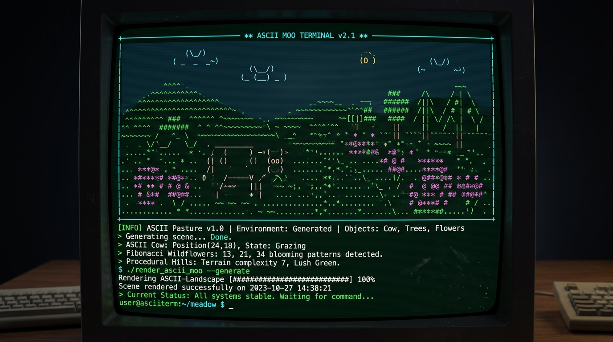
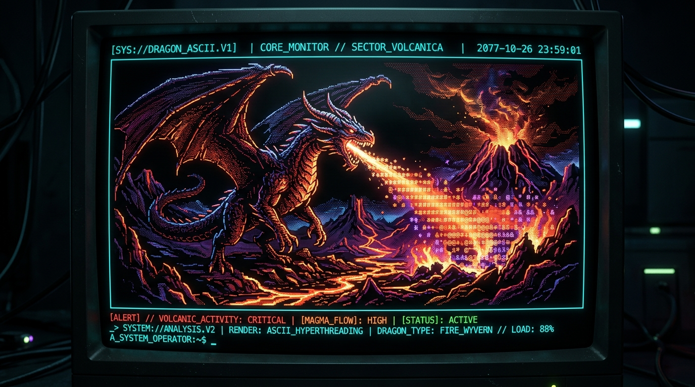

# ⚙️ Forgum Configuration Manual & Showcase

This document is the authoritative guide for configuring Forgum, understanding cross-platform file paths, and exploring curated configuration profiles.

---

## 📑 Table of Contents
1. [Zero-Config Philosophy vs Expert Customization](#1-zero-config-philosophy-vs-expert-customization)
2. [Configuration File Locations Across Platforms](#2-configuration-file-locations-across-platforms)
3. [Supported Formats (JSON, YAML, TOML)](#3-supported-formats-json-yaml-toml)
4. [Mascot Showcase & Sample Configurations](#4-mascot-showcase--sample-configurations)
   - [A. Celestial Cow in Alpine Pasture](#a-celestial-cow-in-alpine-pasture)
   - [B. Draconic Inferno & Volcanic Ridge](#b-draconic-inferno--volcanic-ridge)
5. [Interactive CLI & TUI Config Management](#5-interactive-cli--tui-config-management)
6. [Complete Configuration Schema Reference](#6-complete-configuration-schema-reference)

---

## 1. Zero-Config Philosophy vs Expert Customization

Forgum requires **zero configuration** to use immediately:
- Running `forgum` instantly selects an authentic ASCII mascot, natural TrueColor styling, and dynamic physics.
- Running `forgum --random` applies our mathematical Fibonacci phyllotaxis sequence, generating a fresh, non-repeating combination of mascot, scenery, effect, and thought on every execution.

For power users, Forgum provides complete control over every parameter: physics velocity, particle emitters, road textures, harmonic mountains, speech styles, and frame rates.

---

## 2. Configuration File Locations Across Platforms

Forgum discovers configurations hierarchically. The default configuration file paths are:

| Operating System | Primary Configuration Path |
| :--- | :--- |
| **Windows** | `%USERPROFILE%\.config\forgum\config.json` *(or `.yaml` / `.toml`)*<br>`%LOCALAPPDATA%\Forgum\config.json` *(fallback)* |
| **Linux** | `~/.config/forgum/config.json` *(XDG Base Directory compliant)* |
| **macOS** | `~/.config/forgum/config.json`<br>`~/Library/Application Support/forgum/config.json` |

> [!TIP]
> You can override the configuration file path at any time using the `FORGUM_CONFIG` environment variable or the `--config <path>` command-line flag:
> ```bash
> forgum --config ./custom_theme.json
> ```

---

## 3. Supported Formats (JSON, YAML, TOML)

Forgum natively auto-discovers and parses configurations in your preferred markup:
- `config.json` (Strict JSON schema validation)
- `config.yaml` / `config.yml` (Human-readable YAML)
- `config.toml` (Standard TOML format)

You can migrate between formats on the fly using:
```bash
forgum config --migrate yaml
forgum config --migrate toml
forgum config --migrate json
```

---

## 4. Mascot Showcase & Sample Configurations

### A. Celestial Cow in Alpine Pasture

A serene alpine pasture featuring procedural harmonic rolling hills, Fibonacci wildflower phyllotaxis, and the signature walking cow.



#### Configuration: `docs/samples/cow_pasture.json`
```json
{
  "cow": "default",
  "animation_type": "walk",
  "environment": "pasture",
  "road": "dirt",
  "mountain": "hills",
  "color_mode": "natural",
  "palette": "#10b981,#06b6d4,#f59e0b",
  "banner": true,
  "fps": 30,
  "duration": 5,
  "text": "Moo! Exploring the infinite mathematical pasture with Fibonacci phyllotaxis trees.",
  "think": false
}
```

#### Run with Forgum:
```bash
forgum --config docs/samples/cow_pasture.json
# Or via CLI arguments:
forgum --cow default --anim walk --scenery pasture --road dirt --mountain hills --color-mode natural
```

---

### B. Draconic Inferno & Volcanic Ridge

A fearsome fire-breathing dragon perched over Mount Volcanica with flowing magma terrain and glowing plasma ember particles.



#### Configuration: `docs/samples/dragon_inferno.json`
```json
{
  "cow": "dragon",
  "animation_type": "breathe",
  "environment": "inferno",
  "road": "magma",
  "mountain": "volcano",
  "color_mode": "animal_natural",
  "palette": "#ef4444,#f59e0b,#7c3aed",
  "banner": true,
  "fps": 30,
  "duration": 6,
  "text": "Roaaar! From the fiery depths of Mount Volcanica, I breathe ANSI plasma flames!",
  "think": false
}
```

#### Run with Forgum:
```bash
forgum --config docs/samples/dragon_inferno.json
# Or via CLI arguments:
forgum --cow dragon --anim breathe --scenery inferno --road magma --mountain volcano
```

---

## 5. Interactive CLI & TUI Config Management

### Open Interactive Configuration Studio (TUI)
```bash
forgum config --tui
# or
forgum tui
```
Use the arrow keys to navigate properties, change values in real time, and press `Ctrl+S` to save.

### View All Config Values via CLI
```bash
forgum config --list
```

### Set Specific Values Headless
```bash
forgum config shell_attach_mode split
forgum config auto_render_on_prompt true
forgum config fps 60
```

---

## 6. Complete Configuration Schema Reference

| Field | Type | Default | Description |
| :--- | :--- | :--- | :--- |
| `cow` | `string` | `"default"` | Mascot identifier (e.g. `default`, `dragon`, `tux`, `corgi`, `random`) |
| `animation_type` | `string` | `"animal_natural"` | Kinematic motion (`walk`, `breathe`, `float`, `fly`, `talk`, `sway`, `pulse`) |
| `environment` | `string` | `"pasture"` | Atmospheric particle emitter (`pasture`, `inferno`, `ocean`, `space`, `none`) |
| `road` | `string` | `"dirt"` | Ground / road style (`dirt`, `cobblestone`, `magma`, `ice`, `none`) |
| `mountain` | `string` | `"hills"` | Procedural horizon style (`hills`, `peaks`, `volcano`, `skyline`, `none`) |
| `color_mode` | `string` | `"natural"` | Coloring engine (`natural`, `rainbow`, `solid`, `none`) |
| `fps` | `integer` | `30` | Target frame rate (1-120) |
| `duration` | `integer` | `3` | Playback duration in seconds (0 = infinite in background) |
| `shell_attach_mode` | `string` | `"split"` | Shell rendering mode (`split`, `banner`, `reactive`, `manual`) |
| `auto_render_on_prompt` | `boolean` | `true` | Automatically render mascot on each prompt execution |
| `startup_animation` | `boolean` | `true` | Play animation on new terminal window spawn |
| `startup_animation_once_per_day` | `boolean` | `false` | Limit startup animation to once per calendar day |
